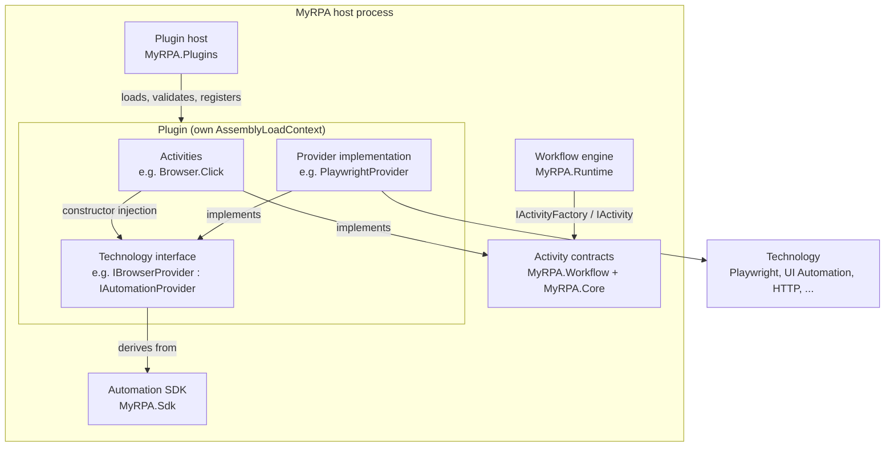
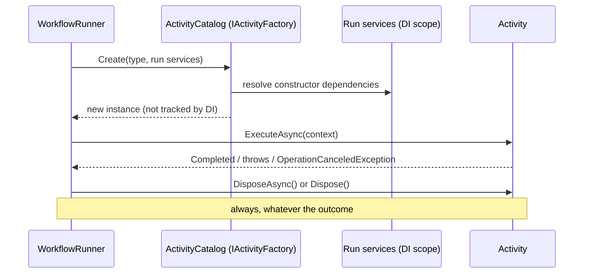
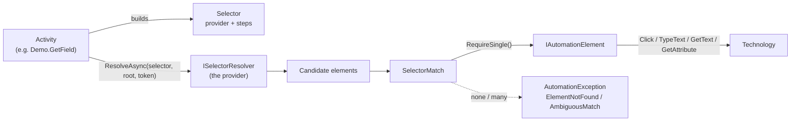

# Automation SDK

Status: Phase 3. SDK version **1.0**. The decisions behind this document are recorded in
[ADR-0013](../adr/0013-automation-sdk-and-activity-contract.md). Plugin packaging and loading are described in
[plugin-system.md](plugin-system.md).

The Automation SDK is everything a plugin compiles against. Its purpose is to let MyRPA gain automation
technologies (browser, Windows, API, Office, Python, JavaScript, AI, MCP, storage, triggers) without the workflow
engine ever depending on them.



## What the SDK contains

| Assembly | Namespace | Types | Purpose |
|---|---|---|---|
| MyRPA.Core | `MyRPA.Core.Activities` | `ActivityTypeName`, `ActivityDescriptor`, `ActivityPropertyDefinition`, `ActivitySlotDefinition` | Activity identity and metadata |
| MyRPA.Core | `MyRPA.Core.Diagnostics` | `ExecutionIdentity` | Correlation ids |
| MyRPA.Workflow | `MyRPA.Workflow.Execution` | `IActivity`, `IActivityContext`, `ActivityResult`, `ActivityFailedException` | The activity contract |
| MyRPA.Workflow | `MyRPA.Workflow.Values` | `WorkflowValues` | Canonical values |
| MyRPA.Sdk | `MyRPA.Sdk` | `AutomationSdk`, `SdkVersion` | SDK version |
| MyRPA.Sdk | `MyRPA.Sdk.Plugins` | `IPlugin`, `IPluginRegistrar`, `PluginContext`, `PluginInfo`, `PluginId`, `PluginVersion`, `PluginServiceLifetime` | The plugin contract |
| MyRPA.Sdk | `MyRPA.Sdk.Automation` | `IAutomationProvider`, `AutomationProviderId`, `AutomationProviderDescriptor`, `IAutomationElement`, `Selector`, `SelectorStep`, `SelectorStrategies`, `ISelectorResolver`, `SelectorMatch`, `AutomationException`, `AutomationErrorTypes` | Technology-neutral automation abstractions |

Plugins may also reference `Microsoft.Extensions.Logging.Abstractions` and
`Microsoft.Extensions.DependencyInjection.Abstractions`. The host shares these assemblies with plugins. Plugins
never reference `MyRPA.Runtime`, `MyRPA.Activities`, `MyRPA.Plugins`, `MyRPA.Storage` or `MyRPA.Cli`; the
architecture tests enforce this.

These abstractions are deliberately **not** in the SDK yet:
- `IRecorderPlugin` belongs to Phase 6 (recorder).
- `ITrigger` belongs to Phase 10 (scheduling and events).

Nothing consumes them before then, so their shape would be guesswork (ADR-0013).

## Activity contract

### Identity
An activity type is identified by `Namespace.Name`, for example `Browser.Click` or `Demo.Echo`:
- The name is stable, serialized in workflow files, checked by validation and listed in the plugin manifest.
- It is never a CLR type name and never includes a version.
- `Core.*` is reserved for built-in activities.
- A behaviour change that breaks existing workflows needs a new name or a new plugin major version.

### Metadata
An `ActivityDescriptor` declares the activity's display name, category and description, its properties by kind, and
whether it has children or named slots. Validation, the CLI, Studio and AI tooling all read activity metadata from
the descriptor, never from code.

| Property kind | Evaluated as | Accessor |
|---|---|---|
| `Expression` | Constrained expression (ADR-0009) | `Evaluate`, `EvaluateText`, `EvaluateInt`, ... |
| `Text` | Literal text | `GetText` |
| `AssignmentTarget` | Name of a writable variable or argument | `GetName` + `SetValue` |
| `LocalName` | Read-only local visible in given slots | `GetName` |
| `ExpressionMap` | Name → expression | `EvaluateMap` |
| `AssignmentTargetMap` | Key → writable name | `GetNameMap` + `SetValue` |

### Lifetime and resource ownership



| Owner | Lifetime | Disposed | Register with |
|---|---|---|---|
| Activity instance | one node invocation | right after the invocation | `AddActivity<T>` |
| Run service | one top-level run (shared with invoked workflows) | when the run ends, in any status | `AddService<,>(PluginServiceLifetime.Run)` |
| Plugin service / provider | host lifetime; thread-safe | at host shutdown | `AddService<,>(PluginServiceLifetime.Plugin)`, `AddProvider<,>` |
| Plugin-owned instance | plugin lifetime | by the plugin itself | `AddInstance` |

Put a resource with the owner whose lifetime matches it:
- **Browser session, native window handle, COM object** for one run: a *run* service, which activities receive by
  constructor.
- **HTTP client, driver, connection pool**: a *plugin* service or the provider itself.
- **External process started by a run**: a run service that stops the process in `DisposeAsync`.

An activity instance itself holds nothing expensive.

### Results and failures

| Situation | What the activity does | What the workflow sees |
|---|---|---|
| Success | returns `ActivityResult.Completed` | outputs assigned with `SetValue` |
| Classified failure | throws `ActivityFailedException(errorType, message)` or `AutomationException` | node fails: code `MYRPA2001`, `errorType` (e.g. `ElementNotFound`); `Core.TryCatch` exposes `err.errorType` |
| Unexpected failure | any other exception | node fails: code `MYRPA2001`, `errorType` = exception type name |
| Cancellation or timeout of the run | lets `OperationCanceledException` of `context.CancellationToken` propagate | run status `Cancelled` / `TimedOut` (never catchable) |

- `ActivityResult` is about one node, and in SDK 1.0 it has one outcome, `Completed`.
- `WorkflowExecutionResult` is about a whole run: its status, outputs, timing and the error attributed to the failing
  node. Activities never create it.
- `SetValue` accepts only names declared by the node's assignment-target properties.

Well-known automation error types (`AutomationErrorTypes`) are: `ElementNotFound`, `AmbiguousMatch`, `ElementStale`,
`InvalidSelector`, `NotSupported`, `ProviderUnavailable` and `OperationTimeout`. An operation-level timeout is a
catchable failure; the run's timeout is not.

### Cancellation contract
- `context.CancellationToken` is cancelled when the run is cancelled or any applicable timeout elapses (its own, or
  that of an invoking workflow). Pass it to every awaited call and let `OperationCanceledException` propagate.
- Cancellation is cooperative. The engine never aborts or abandons a running activity: it waits for the activity,
  then runs no further nodes. Synchronous code that ignores the token cannot be interrupted.
- If a technology cannot cancel an in-flight operation, stop waiting for it when the token fires, mark the affected
  session unusable, and return. Do not block the engine.
- Cleanup after cancellation is allowed in `finally` and `DisposeAsync`. It must be bounded and use its own token.
- An `OperationCanceledException` from the activity's *own* timeout (not the run token) is reported as a node failure.
- `context.Deadline` is the earliest applicable timeout, for APIs that take a timeout instead of a token.

### Execution context
`IActivityContext` offers the following, and nothing else:
- `Node` and `Identity` (execution, correlation, workflow and node id);
- `CancellationToken` and `Deadline`;
- `TimeProvider`;
- typed property access;
- `SetValue` for declared targets;
- `ExecuteAsync` for the node's own children and slots;
- `InvokeWorkflowAsync`.

It has no service locator. Logging and tracing work like this:
- **Logging:** inject `ILogger<T>`. Every entry written during `ExecuteAsync` carries the `myrpa.execution.id`,
  `myrpa.workflow.id` and `myrpa.node.id` scope values.
- **Tracing:** the engine creates one span per node. An activity may create child spans with its own
  `ActivitySource`.

## Providers, elements and selectors



- **`IAutomationProvider`** marks the technology boundary and carries an `AutomationProviderDescriptor` (id, display
  name, technology).
  - Every technology defines its own interface deriving from it, which the PRD calls `IBrowserProvider`,
    `IWindowsAutomationProvider`, `IApiProvider` and so on. Activities depend on that interface through constructor
    injection.
  - Providers are registered with plugin lifetime and must be thread-safe. Per-run state belongs in run services.
- **`IAutomationElement`** is a found element: the common operations are click, type text, get text and get
  attribute. Technologies extend it with their own interfaces.
  - An unsupported operation throws `NotSupported`; a vanished element throws `ElementStale`.
  - Elements are runtime objects owned by their provider or session. Workflow variables hold only canonical values,
    never elements.
- **Selectors** are data: a provider id plus an ordered path of steps, each `strategy=value` (strategies such as
  `Css`, `XPath`, `Text`, `Role`, `Accessibility`, `Attributes`, `AutomationId`, or provider-defined ones).
  - Each step narrows the search to within the previous step's match.
  - `ISelectorResolver.ResolveAsync` returns the elements that match now. Waiting and retry policy belong to the
    activity.
  - How selectors are written in workflow files, and how alternatives are ranked, is decided in Phase 6.

## Writing an activity (abridged from the sample plugin)

```csharp
public sealed class GetFieldActivity(IDemoTextProvider provider) : IActivity
{
    public static ActivityDescriptor Descriptor { get; } = new(
        new ActivityTypeName("Demo.GetField"), "Get Field", "Demo", "Reads one field of a document.",
        [
            new("document", ActivityPropertyKind.Expression, isRequired: true),
            new("field", ActivityPropertyKind.Text, isRequired: true),
            new("to", ActivityPropertyKind.AssignmentTarget, isRequired: true),
        ]);

    public async ValueTask<ActivityResult> ExecuteAsync(IActivityContext context)
    {
        if (context.Evaluate("document") is not IReadOnlyDictionary<string, object?> fields)
        {
            throw new ActivityFailedException("InvalidArgument", "'document' must evaluate to a Dictionary.");
        }

        var root = provider.OpenDocument(fields);
        var selector = new Selector(DemoTextProvider.Id, [new SelectorStep("Demo.Field", context.GetText("field"))]);
        var match = await provider.ResolveAsync(selector, root, context.CancellationToken);
        var text = await match.RequireSingle().GetTextAsync(context.CancellationToken); // ElementNotFound if missing
        context.SetValue(context.GetName("to"), text);
        return ActivityResult.Completed;
    }
}
```

The full sample, including the plugin entry point, manifest and provider, is in
`samples/plugins/MyRPA.Samples.DemoPlugin/`.

## Versioning
- `AutomationSdk.Version` (currently 1.0) is the contract version:
  - a **minor** version only adds members (for example a new `ActivityResult` outcome, or a new context member with a
    default behaviour);
  - a **major** version may remove or change members.
- A host accepts plugins built for the same major version and an equal or lower minor version.
- The workflow schema version (1.0) and the manifest version (1.0) are versioned independently of the SDK.
- Technical debt: the SDK assemblies still carry the product assembly version (0.1.0). Before a public SDK, their
  assembly versions must follow the SDK version, so that runtime binding and the manifest check agree.
