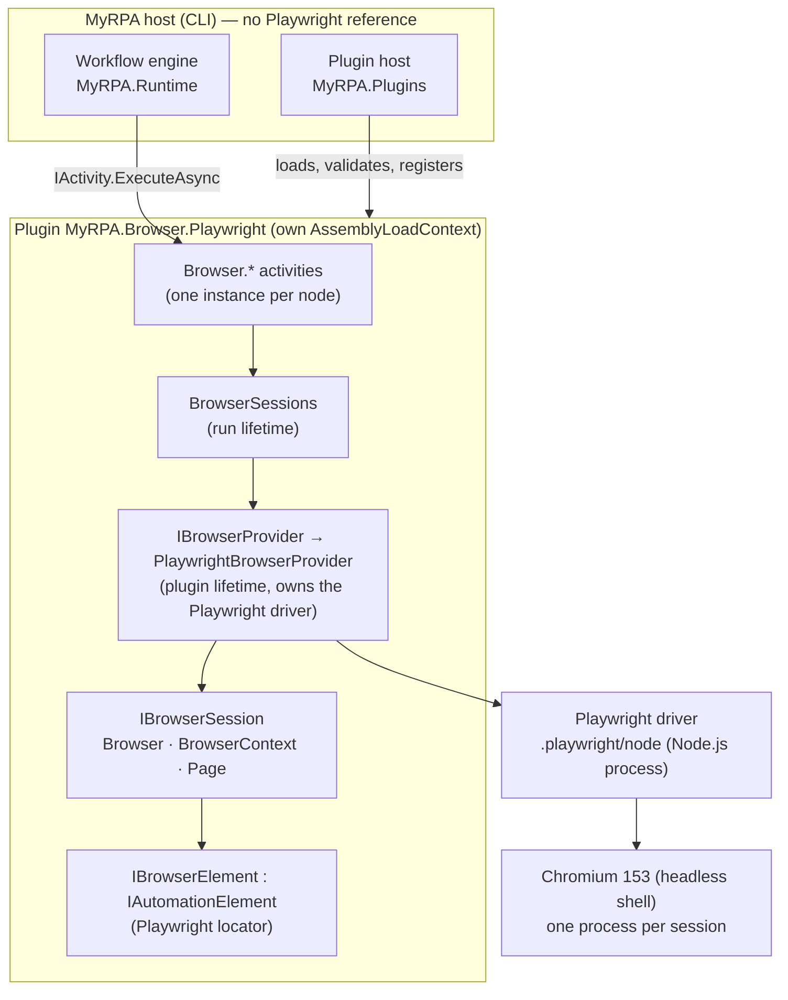
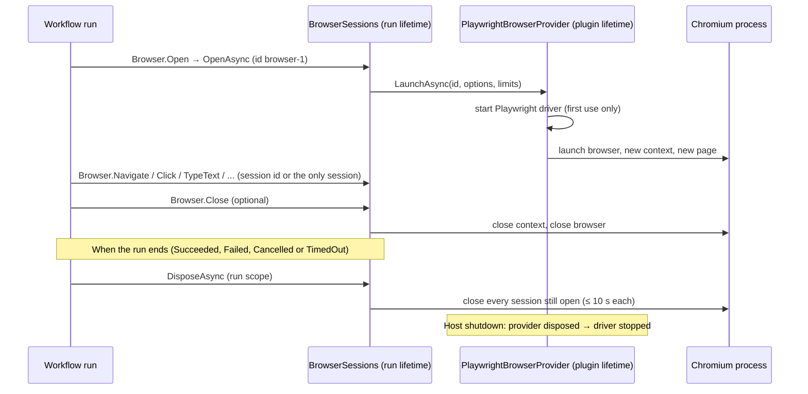

# Browser automation (Playwright plugin)

Status: Phase 4. Decisions: [ADR-0017](../adr/0017-browser-automation-provider.md) (provider, sessions, activities,
errors, security) and [ADR-0016](../adr/0016-verified-path-based-plugin-loading.md) (plugin loading change). Plugin
mechanics: [plugin-system.md](plugin-system.md). Contracts: [automation-sdk.md](automation-sdk.md).

## Architecture



- Core, Workflow, Runtime and the CLI do not reference Playwright. The architecture tests allow `Microsoft.Playwright`
  only in `MyRPA.Browser.Playwright`.
- The browser contract types (`IBrowserProvider`, `IBrowserSession`, `IBrowserElement`, `BrowserErrorTypes`) live
  inside the plugin and build on SDK types: `IAutomationProvider`, `IAutomationElement`, `Selector`,
  `AutomationException`. The SDK is unchanged.

## Session lifecycle



- **One browser process per session**, with a fresh context: no shared cookies, storage, cache or pages.
- Session ids are `browser-1`, `browser-2`, … per run. `Browser.Open`'s `to` receives the id. Other activities take
  `session`; without it, the only open session is used, and it is an error when none or several are open.
- **No browser outlives its run.** This covers failure, cancellation and timeout, and a launch interrupted by
  cancellation.
- Workflows invoked with `Core.InvokeWorkflow` share the invoking run's sessions.

## Activities

Common properties:
- `selector` (Text) — see [Selectors](#selectors). Element operations are strict: exactly one match.
- `session` (expression, optional) — a session id from `Browser.Open`; defaults to the only open session.
- `timeoutMilliseconds` (expression, optional) — defaults to the plugin setting `defaultTimeoutMilliseconds` (30 000).
  It is capped at the time left before the run's deadline.

| Activity | Properties | Behaviour |
|---|---|---|
| `Browser.Open` | `browser` (text: `chromium`), `headless` (bool, default true), `url`, `to` (session id), timeout | Launches a session; optionally navigates. |
| `Browser.Navigate` | `url` (req), `waitUntil` (`load` default, `domcontentloaded`, `networkidle`, `commit`), session, timeout | http, https or about:blank only. HTTP 400+ and network errors fail. |
| `Browser.Click` | selector, session, timeout | Waits until visible, enabled and stable, then clicks. |
| `Browser.TypeText` | selector, `text` (req), `clear` (bool, default true), session, timeout | Replaces the content (fill), or types key by key after it when `clear` is false. |
| `Browser.GetText` | selector, `to` (req), session, timeout | Rendered (inner) text. |
| `Browser.GetAttribute` | selector, `name` (text, req), `to` (req), session, timeout | Attribute value, or null when absent. |
| `Browser.WaitForElement` | selector, `state` (`visible` default, `attached`, `hidden`, `detached`), session, timeout | Fails when the timeout elapses. |
| `Browser.SelectOption` | selector, `value` (String or List; by value or label), `to` (List), session, timeout | Selects in a `<select>`. |
| `Browser.UploadFile` | selector, `files` (String or List), session, timeout | Sets an `input type=file`. Paths are confined to `fileRoot`. |
| `Browser.DownloadFile` | selector (element that starts the download), `path` (req), `overwrite` (bool), `to` (saved path), session, timeout | Clicks, waits for the download and saves it. Destination confined to `fileRoot`. |
| `Browser.Close` | session | Closes the session's browser. |

Plugin settings, from `PluginSource.Settings` in code hosts; the CLI cannot pass them yet:

| Setting | Default | Meaning |
|---|---|---|
| `defaultTimeoutMilliseconds` | `30000` | Timeout of operations without their own. |
| `headless` | `true` | Default for `Browser.Open`. |
| `fileRoot` | host working directory | The only directory tree for uploads and downloads. |

Example: `samples/plugins/browser-demo.json` is a complete open, navigate, type, click, read and close workflow.

## Selectors
This is a provisional Phase 4 syntax. Phase 6 defines the final selector format, generation and recording. The text
is parsed into the SDK `Selector` (provider `Browser.Playwright`).

| Syntax | Strategy | Meaning |
|---|---|---|
| `css=#login` or `#login` | Css | CSS selector (the default without a prefix). |
| `xpath=//form/button` or `//form/button` | XPath | XPath (the default when the text starts with `/` or `(`). |
| `text=Sign in` | Text | Elements containing the text (case-insensitive, whitespace-normalized). |
| `role=button` / `role=button\|Sign in` | Role | ARIA role, optionally with the exact accessible name. |
| `css=form#login >> role=button\|Submit` | chained | Each step searches within the previous match. |

Invalid selectors fail with `InvalidSelector`, from our parser or from the browser engine (e.g. malformed CSS or XPath).

## Errors
Failures are classified in `errorType`, which `Core.TryCatch` exposes as `err.errorType`. Error code MYRPA2001:

| errorType | When |
|---|---|
| `ElementNotFound` | No element matched within the timeout. |
| `ElementTimeout` | Elements matched but did not become actionable, visible, hidden or detached in time. |
| `AmbiguousMatch` | More than one element matched. |
| `InvalidSelector` | Malformed selector. |
| `ProviderUnavailable` | Browser or driver not installed (the message includes the install command). |
| `BrowserLaunchFailed` | The browser could not start. |
| `NavigationFailed` | Network error, HTTP 400+, aborted navigation. |
| `InvalidUrl` | Not an absolute http, https or about:blank URL. |
| `SessionClosed` / `SessionNotFound` | Closed or disconnected session / unknown id, or no unique open session. |
| `OperationTimeout` | A navigation or download exceeded its own timeout. |
| `DownloadFailed` | The click started no download, or the download failed. |
| `FileAccessDenied`, `FileNotFound`, `FileAlreadyExists` | File policy (below). |
| `InvalidArgument` | Invalid property value. |
| `BrowserError` | Any other browser failure. |

Cancellation and the **run's** timeout are not errors of a node: the run ends `Cancelled` or `TimedOut`.

## Security
- **No JavaScript evaluation.** No activity runs workflow-supplied script in the page. Pages run their own scripts as
  in any browser.
- **URLs:** `file:` and non-http(s) schemes are refused, so workflows cannot read local files through the browser.
- **Files:** uploads and downloads are confined to `fileRoot`.
  - Relative paths are resolved against it, and absolute paths must be inside it.
  - Links anywhere on the way are refused.
  - Downloads do not overwrite unless `overwrite` is true.
  - There is **no size limit on downloads** (known issue).
- **Isolation:** one browser process and fresh context per session. Nothing persists between sessions.
- **Trust:** the plugin is fully trusted in-process code that starts processes (Node.js driver, Chromium) and uses the
  network (ADR-0015).

## Installation (development and CI)
- **Versions:** Microsoft.Playwright **1.63.0**, pinned in `Directory.Packages.props`. Browsers: **Chromium
  153.0.8010.12 and Chrome Headless Shell, revision 1243**.
- **Build:** `dotnet build` produces the plugin directory `plugins/MyRPA.Browser.Playwright/bin/<Configuration>/net10.0`
  for the build machine's platform, containing:
  - the manifest;
  - the assemblies;
  - `.playwright/` (Node.js driver);
  - `playwright.ps1`.
- **Browsers:** installed once per machine and user, into `%LOCALAPPDATA%\ms-playwright` on Windows and
  `~/.cache/ms-playwright` on Linux:
  ```bash
  pwsh plugins/MyRPA.Browser.Playwright/bin/Debug/net10.0/playwright.ps1 install chromium
  ```
  On Linux, add `--with-deps` to install the system libraries (needs sudo). Windows PowerShell 5.1 also works:
  `powershell -ExecutionPolicy Bypass -File …/playwright.ps1 install chromium`.
- **Tests:** `tests/MyRPA.Browser.Playwright.Tests` launch real headless Chromium against a local `HttpListener`
  site. There are no external websites. They require the browsers above and do not download them. Without browsers
  they fail with `ProviderUnavailable` and the install command.
- **CI:** the workflow installs Chromium after the build and before the tests. The CI workflow has never run, because
  the repository has no remote yet.
- **Supported OS:** tested on **Windows x64 only**. Linux x64 is configured in CI but unverified; macOS is not
  claimed.
- **Hosts:** must be non-AOT with reflection-based `System.Text.Json` (ADR-0016).

## Using it from the CLI
```bash
dotnet build
```

```bash
pwsh plugins/MyRPA.Browser.Playwright/bin/Debug/net10.0/playwright.ps1 install chromium
```

```bash
dotnet run --project src/MyRPA.Cli -- --plugin plugins/MyRPA.Browser.Playwright/bin/Debug/net10.0 run samples/plugins/browser-demo.json --arg url=https://example.com
```
