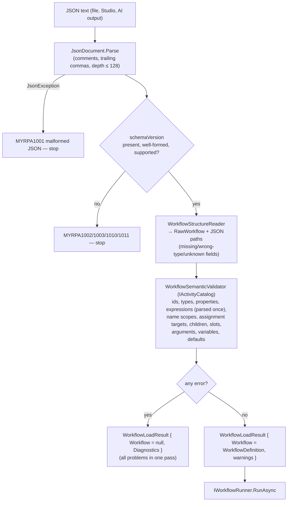
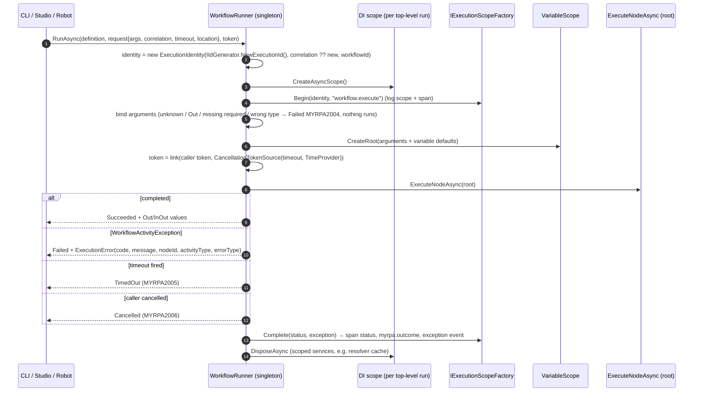
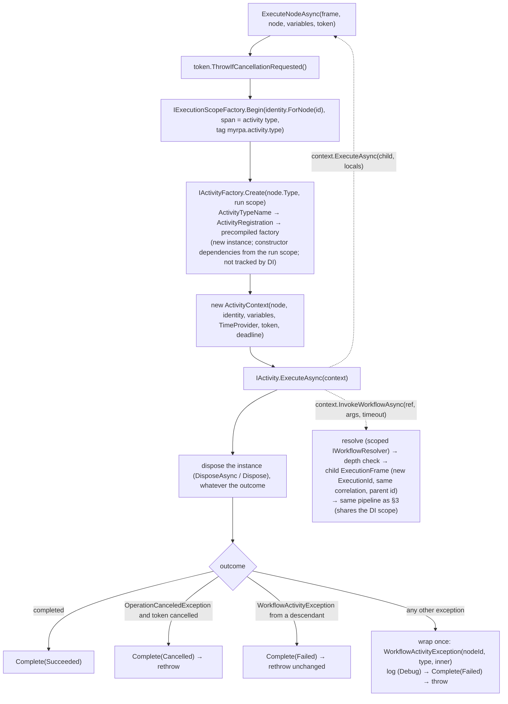
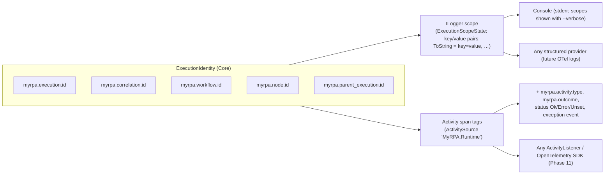

# Execution Model

Decisions: [ADR-0010](../adr/0010-workflow-execution-model.md) (execution model), [ADR-0011](../adr/0011-workflow-json-format-and-validation-pipeline.md)
(loading/validation), [ADR-0012](../adr/0012-invoke-workflow-resolution-and-limits.md) (InvokeWorkflow),
[ADR-0006](../adr/0006-observability-foundation.md) (observability). File format: [workflow-format.md](workflow-format.md).

## 1. Concepts and where they live

| PRD concept | Type | Project |
|---|---|---|
| Workflow | `WorkflowDefinition`, `ArgumentDefinition`, `VariableDefinition`, `NodeDefinition`, `PropertyValue` | MyRPA.Workflow |
| Activity | `IActivity` (behavior) · `ActivityDescriptor` (metadata) · `NodeDefinition` (usage) | Workflow · Core · Workflow |
| ActivityContext | `IActivityContext` (implemented by `Runtime.Execution.ActivityContext`) | Workflow · Runtime |
| ExecutionContext | `ExecutionIdentity` (ids) + internal `ExecutionFrame` / `VariableScope` (state) | Core · Runtime |
| WorkflowRunner | `IWorkflowRunner` / `WorkflowRunner` | Workflow · Runtime |
| ActivityResult | `ActivityResult` | Workflow |
| WorkflowExecution | `WorkflowExecutionResult`, `ExecutionError`, `ExecutionStatus` | Workflow · Core |

Definition data (immutable, shared, serializable) and runtime state (per execution, never serialized) are separate types.

## 2. Loading and validation

Model constructors enforce only invariants (non-null, identifier formats, unique ids/names) and throw for programmer
errors; user input never reaches them unvalidated.

## 3. Workflow execution

The runner **returns** a result for every workflow outcome; it throws only for invalid calls (null arguments).

## 4. Activity execution

What an activity can do is exactly `IActivityContext` (frozen for SDK 1.0, [ADR-0013](../adr/0013-automation-sdk-and-activity-contract.md)):
read properties (expressions are evaluated against the current `VariableScope`), assign the variables named by its own
assignment-target properties (type-checked; other names are rejected), run its own children/slots (optionally with
read-only locals), invoke another workflow, and observe the token, deadline and clock. Activities cannot execute
arbitrary nodes, touch engine state, or reach a service locator.

**Activity lifetime.** Each node invocation gets a new activity instance, and the engine disposes it right after the
invocation. A disposal failure after success fails the node; after a failure or cancellation it is logged and the
original outcome wins. Longer-lived resources belong to run-lifetime services (the run's DI scope, disposed when the
run ends) or plugin-lifetime services (singletons). The run's DI scope therefore no longer retains activity instances.

**Cancellation is cooperative.** The token is cancelled on caller cancellation or when a timeout of this execution or
of any invoking execution elapses; `IActivityContext.Deadline` exposes that earliest timeout. The engine never aborts or
abandons a running activity: it waits for it and then starts no further nodes.

### Status semantics

| Status | Cause | Error code |
|---|---|---|
| `Succeeded` | Root node completed | — |
| `Failed` | A node threw (activity error, `Core.Throw`, expression error, failed child workflow), or run arguments were invalid. `errorType` is the `ActivityFailedException.ErrorType` of a classified failure (e.g. `ElementNotFound`), `Throw`, `Expression`, `InvokeWorkflow`, or the exception type name | 2001–2004, 2007–2009 |
| `TimedOut` | The run's timeout elapsed (request `Timeout` or `WorkflowRuntimeOptions.DefaultTimeout`) | 2005 |
| `Cancelled` | The caller's token was cancelled (e.g. Ctrl+C) | 2006 |

`Core.TryCatch` catches failures of nodes inside `try` (never cancellation or timeouts). A child workflow's
non-success fails the `Core.InvokeWorkflow` node (catchable); a child's own timeout is a failure of that node, while
the parent's timeout or cancellation propagates as `TimedOut`/`Cancelled` of the whole run.

## 5. Execution context and observability

Spans nest: `workflow.execute` → one span per node (named after its activity type) → a child workflow's
`workflow.execute` under the `Core.InvokeWorkflow` node span. Workflow `Core.Log` messages use category
`MyRPA.Workflow.Log`; the CLI shows them at Information level by default.

### Execution events (ADR-0023)

Hosts that display progress attach an `IExecutionObserver` to one run with `WorkflowRunRequest.Observer`. Nothing is
registered globally, so an observer only sees its own run and the workflows it invokes.

- **Events:** `ExecutionStarted` → (`NodeStarted` … `NodeCompleted`)* → `ExecutionCompleted`, per execution, in execution
  order. An invoked workflow's events are nested inside the invoking node's events and carry their own execution id plus
  the parent's.
- **Node status:** `NodeCompleted` is `Succeeded`, `Failed` (with the error; the error's node is where the failure
  originated) or `Cancelled` (the run was cancelled or timed out). `ExecutionCompleted` carries the same status as the
  run's result.
- **Delivery:** calls are synchronous on the executing flow and never overlap within a run.
- **No workflow data:** events carry ids, activity types, statuses, errors and timings only; never variable values,
  arguments or outputs.
- **Independent of observability:** events are emitted whether or not tracing spans are sampled.
- **Observer failures:** a throwing observer is logged (warning 3006) and not called again for that run; the run's
  outcome is unaffected.

`MyRPA.Execution.Hosting` builds on this. Per run it provides a sequenced, bounded replay buffer (a `stream.gap` event
reports dropped events), routes the run's logs by correlation id, supports cancellation and limits concurrency.

## 6. Lifetimes and state

| Component | Lifetime | State |
|---|---|---|
| `WorkflowRunner`, `WorkflowLoader`, `ActivityCatalog`, `ExecutionScopeFactory`, `MyRpaTelemetry`, `TimeOrderedIdGenerator` | Singleton | Stateless / immutable |
| `FileWorkflowResolver` (`IWorkflowResolver`) | Scoped (one per top-level run) | Per-run cache of resolved files |
| Activities | One instance per node invocation, created by `ActivityCatalog` and disposed by the engine (not DI services) | None beyond the invocation |
| Plugin `Run` services | Scoped (one per top-level run, shared with invoked workflows) | Per-run resources (sessions, caches); disposed when the run ends |
| Plugin providers and `Plugin` services | Singleton | Shared, thread-safe; disposed at host shutdown |
| `ExecutionFrame`, `VariableScope`, `ActivityContext` | Per execution / per node (not in DI) | Runtime state |

There are no mutable statics (enforced by `MyRPA.Architecture.Tests`).

## 7. Determinism and testing

- Time: every delay, timeout, timestamp and `now()` uses the injected `TimeProvider`; tests use `FakeTimeProvider`.
- Ids: `IIdGenerator` (default UUIDv7 from the injected clock); tests use a sequential generator.
- Expressions: pure functions over canonical values; no culture, no reflection; `now()` via the clock.
- Loops can be bounded with `maxIterations`; runs can be bounded with timeouts; invocation depth is bounded.

## 8. Security properties

- Activity types resolve only through explicit registrations; workflow text never names .NET types.
- Expressions cannot reach .NET members, types, I/O, processes or the network.
- `InvokeWorkflow` reads only relative `.json` files (≤ 5 MB, no symbolic links) inside the entry workflow's directory.
- No process execution, networking, dynamic assembly loading or type-name resolution in `src` (IL scan), except that
  `PluginLoadContext` loads verified assemblies of explicitly configured plugins
  ([ADR-0014](../adr/0014-plugin-manifest-lifecycle-and-loading.md)). Plugin code itself is fully trusted and not
  restricted by these rules ([ADR-0015](../adr/0015-plugin-trust-model.md)).
