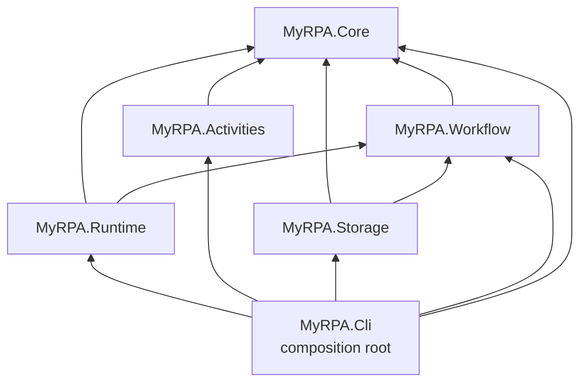

# MyRPA Architecture Overview (Phase 1)

Status: current as of Phase 1 — Foundation (2026-09-23).
Why it looks like this: [phase-1-reconciliation.md](phase-1-reconciliation.md) and the [ADRs](../adr/README.md).
Evidence from the OpenRPA study: [../research/openrpa-analysis.md](../research/openrpa-analysis.md).

## 1. What exists after Phase 1

A buildable, tested .NET 10 foundation:
- a platform-neutral **Core** with identifiers, execution identity, diagnostic names and activity metadata contracts;
- a skeleton of the **single workflow model**;
- **DI composition** through a Generic Host in the CLI;
- a **logging + tracing foundation** (`ILogger` scopes and `ActivitySource` carrying the same correlation keys);
- **architecture tests** that fail the build pipeline when boundaries are crossed.

There is **no** workflow execution, JSON serialization, activity library, provider, plugin loading, persistence,
orchestrator, AI or MCP yet. Those belong to later phases (PRD §9).

## 2. Projects and responsibilities

| Project | Responsibility | Depends on | Packages |
|---|---|---|---|
| `MyRPA.Core` | Platform-neutral contracts: `WorkflowId`, `NodeId`, `ExecutionId`, `CorrelationId`, `Identifier` rules; `ExecutionIdentity`; `DiagnosticNames`; `ActivityTypeName`, `ActivityDescriptor`, `IActivityCatalog` | — | none |
| `MyRPA.Workflow` | The one workflow model: `WorkflowDefinition`, `NodeDefinition`, `WorkflowSchemaVersion` | Core | none |
| `MyRPA.Activities` | `ActivityCatalog` (explicit registrations); built-in activities from Phase 2 | Core | DI.Abstractions |
| `MyRPA.Runtime` | Runtime composition (`AddMyRpaRuntime`), `MyRpaTelemetry` (ActivitySource owner), `IExecutionScopeFactory`; hosts the Phase 2 engine | Core, Workflow | DI.Abstractions, Logging.Abstractions |
| `MyRPA.Storage` | Storage boundary (`AddMyRpaStorage`); abstractions from Phase 2; never a DB driver | Core, Workflow | DI.Abstractions |
| `MyRPA.Cli` (`myrpa`) | Composition root: Generic Host, console logging to stderr, command dispatch, `info` command | all of the above | Hosting |

Tests: `MyRPA.{Core,Workflow,Runtime,Activities}.Tests` (unit), `MyRPA.Integration.Tests` (real CLI host in-process),
`MyRPA.Architecture.Tests` (rules below).

## 3. Dependency direction



- Dependencies point toward Core. Core depends on nothing.
- `Runtime` does **not** depend on `Activities`: the engine must work with whatever activity set a host registers.
- Only composition roots (today: `MyRPA.Cli`; later Studio/Robot/Orchestrator hosts) see the whole graph and
  reference `Microsoft.Extensions.Hosting`.

Future phases (for orientation only, not implemented): providers such as `MyRPA.Providers.Browser` (Playwright) or
`MyRPA.Providers.Windows` (`net10.0-windows`) will depend on Core, and Studio (`net10.0-windows`, WPF) will be a
composition root. Each new project needs an entry in `ArchitectureRules` and, when it changes the direction, an ADR.

## 4. Architecture rules (enforced)

All enforced by `tests/MyRPA.Architecture.Tests` ([ADR-0007](../adr/0007-testing-strategy-and-architecture-tests.md)):

| Rule | Test |
|---|---|
| Every `src` project has a rule entry | `ProjectGraphTests.EverySourceProject_HasAnArchitectureRule` |
| Project references stay inside each project's allow-list | `ProjectGraphTests.ProjectReferences_AreWithinAllowList` |
| No cycles (src + tests); nothing references a composition root; `src` never references tests | `ProjectGraphTests.*` |
| Runtime does not reference Activities | `ProjectGraphTests.Runtime_DoesNotDependOnActivityLibrary` |
| Test projects reference only their subject | `ProjectGraphTests.TestProjects_ReferenceOnlyTheirSubjects` |
| All `src` assemblies target plain `net10.0` (no `-windows`), no `UseWPF`/`UseWindowsForms`/`FrameworkReference` | `PlatformNeutralityTests.*` |
| Package references stay inside per-project allow-lists; Core/Workflow have none | `PlatformNeutralityTests.*` |
| No forbidden technology in packages or compiled references (WPF/WinForms/XAML, Playwright/Selenium/CEF/WebView2, FlaUI/UIA, WF4/CoreWF, SQLite/SqlClient/EF/Npgsql/Dapper/LiteDB/MongoDB, OpenAI/Anthropic/Azure.AI/SemanticKernel/M.E.AI, MCP, RabbitMQ/MassTransit/gRPC/ASP.NET Core) | `PlatformNeutralityTests.*` |
| Core/Workflow compiled references are BCL-only | `PlatformNeutralityTests.CoreAndWorkflow_ReferenceOnlyTheBclAndAllowedProjects` |
| Only composition roots reference Hosting and are executables | `PlatformNeutralityTests.OnlyCompositionRoots_*` |
| No `async void`; no mutable static fields | `CodeRuleTests.*` |
| No `Type.GetType(string)`, `Assembly.Load*`, `AppDomain.Load*/CreateInstance*`, `AssemblyLoadContext.LoadFrom*`, `Activator.CreateInstance(string…)`, `BinaryFormatter` (IL scan) | `CodeRuleTests.NoBannedApiCalls` |

Detectors are self-tested against known-bad samples (`CodeRuleTests.Detectors_FindViolationsInKnownBadSamples`,
`ProjectGraphTests.FindCycle_DetectsCycle`).

## 5. Composition

```text
myrpa <args>
  → CliApplication.RunAsync
      → Host.CreateApplicationBuilder (ContentRoot = install dir, not CWD)
          logging: SimpleConsole → stderr; Warning (default) / Debug (--verbose)
          services: AddMyRpaCli → AddMyRpaRuntime + AddMyRpaActivities + AddMyRpaStorage + CLI commands
          container: ValidateOnBuild + ValidateScopes
      → host.StartAsync → CliCommandDispatcher.DispatchAsync(args, token linked to Ctrl+C)
      → host.StopAsync
```

Exit codes: `0` success, `1` failure, `2` usage, `130` cancelled (`CliExitCodes`).

## 6. Observability

- One `ActivitySource` named `MyRPA.Runtime`, owned by the DI singleton `MyRpaTelemetry`.
- `IExecutionScopeFactory.Begin(identity, operationName)` opens an `ILogger` scope and starts a span; both carry
  `myrpa.execution.id`, `myrpa.correlation.id` and, when known, `myrpa.workflow.id` and `myrpa.node.id`.
- `myrpa info` opens a `cli.info` scope to demonstrate this end to end (verified by `CliHostTests.Info_EmitsRuntimeSpanWithExecutionId`).
- No exporter is configured in Phase 1; any OpenTelemetry listener can subscribe to `MyRPA.*` sources.

## 7. Security baseline

See [ADR-0008](../adr/0008-secure-by-default-baseline.md). Phase 1 opens no ports, makes no network calls, loads no
code dynamically, reads configuration only from the install directory and environment, and stores no secrets.

## 8. Handoff to Phase 2

Phase 2 builds on these seams (it is not started):
- **Workflow model** — add arguments (In/Out/InOut), variables and node properties to `WorkflowDefinition`/`NodeDefinition`;
  add the versioned `System.Text.Json` serializer and the validator.
- **Activity contract** — design the activity execution interface and context (async, `CancellationToken`, results).
  Name the context `WorkflowExecutionContext`, not `ExecutionContext` (reconciliation C5).
- **Engine** — place it in `MyRPA.Runtime`; open one execution scope per run and per node via `IExecutionScopeFactory`;
  resolve activity types via `IActivityCatalog`.
- **CLI** — add `run`/`validate` commands as new `ICliCommand` registrations (consider `System.CommandLine`).
