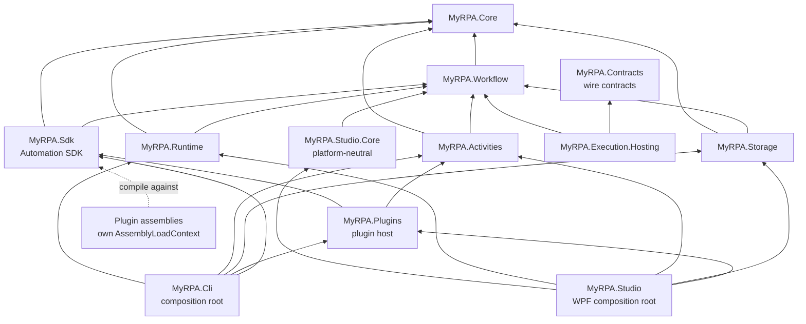

# MyRPA Architecture Overview

Status: current as of **Phase 5 — MyRPA Studio** (2026-09-25).
Why it looks like this: [phase-1-reconciliation.md](phase-1-reconciliation.md) and the [ADRs](../adr/README.md).
Details: [execution-model.md](execution-model.md) (engine), [workflow-format.md](workflow-format.md) (JSON format),
[automation-sdk.md](automation-sdk.md) (activity/provider contract), [plugin-system.md](plugin-system.md) (plugins),
[browser-automation.md](browser-automation.md) (Playwright browser plugin), [studio.md](studio.md) (Studio).
Evidence from the OpenRPA study: [../research/openrpa-analysis.md](../research/openrpa-analysis.md).

## 1. What exists

- A platform-neutral **Core** (identifiers, `IIdGenerator`, execution identity, diagnostic names, `ExecutionStatus`,
  activity metadata/schema contracts).
- The **single workflow model** with arguments, variables, typed property values and slots; a **versioned JSON format**
  with a multi-error **validation pipeline**; a constrained **expression language**; execution **contracts**.
- A deterministic, async **workflow engine** with cancellation, timeouts, error attribution, nested workflow
  invocation, per-run DI scopes, structured logging scopes and tracing spans.
- **12 built-in activities**: Sequence, Assign, Log, Delay, If, Switch, While, DoWhile, ForEach, TryCatch, Throw,
  InvokeWorkflow.
- File-based workflow loading with a confined resolver for `InvokeWorkflow`.
- The **Automation SDK** (SDK 1.0): the frozen activity contract (per-invocation lifetime, classified failures,
  cooperative cancellation, minimal context), the plugin contract (`IPlugin`, `IPluginRegistrar`), and
  technology-neutral provider, element and selector abstractions.
- The **plugin host**: manifests, explicit allow-listed discovery, compatibility/dependency/integrity checks,
  one collectible `AssemblyLoadContext` per plugin, the Discover → Validate → Load → Initialize → Register → Use →
  Dispose lifecycle with failure isolation, and a sample plugin (`Demo.Echo`, `Demo.GetField`, `Demo.Text` provider).
- The **browser automation plugin** `MyRPA.Browser.Playwright` (Playwright 1.63.0, Chromium): 11 `Browser.*`
  activities, run-lifetime browser sessions (one browser process per session, closed when the run ends), a provisional
  selector syntax over the SDK `Selector`, structured browser error types, a confined upload/download file policy, and
  no JavaScript evaluation. Plugin assemblies are now loaded from their verified path (ADR-0016).
- **MyRPA Studio** (WPF): a structured nested-block designer with toolbox, properties, variables, arguments, output,
  logs and errors; drag/drop, nesting, undo/redo, copy/paste, save/open and run through the same engine, with the
  running node highlighted. Its logic lives in the platform-neutral `MyRPA.Studio.Core` (ADR-0018).
- The `myrpa` CLI: `validate`, `run`, `info`, `plugins`, `catalog`, and the global `--plugin <directory>` and
  `--plugin-config <file>` options (ADR-0019, ADR-0020).
- Unit, integration (in-process and child-process) and architecture tests.

Not yet: recorder/selector engine (6), Windows and other enterprise automation (7), AI/MCP (8–9),
orchestrator/queues/triggers (10), RBAC/credentials (11), packages/signing (12).

## 2. Projects and responsibilities

| Project | Responsibility | Depends on | Packages |
|---|---|---|---|
| `MyRPA.Core` | Identifiers (`WorkflowId`, `NodeId`, `ExecutionId`, `CorrelationId`, `IIdGenerator`), `ExecutionIdentity`, `DiagnosticNames`, `ExecutionStatus`, activity metadata (`ActivityTypeName`, `ActivityDescriptor`, property/slot definitions, `IActivityCatalog`) | — | none |
| `MyRPA.Workflow` | Workflow model; values (`WorkflowValues`, `WorkflowDataType`); expressions; JSON reader/writer; `WorkflowLoader` validation pipeline; execution contracts (`IActivity`, `IActivityContext`, `IActivityFactory`, `IWorkflowRunner`, `IWorkflowResolver`, results, exceptions) | Core | none (BCL `System.Text.Json`) |
| `MyRPA.Activities` | `ActivityCatalog` (catalog + per-invocation factory), `ActivityRegistration`, `AddActivity<T>` registration, built-in `Core.*` activities | Core, Workflow | DI.Abstractions, Logging.Abstractions |
| `MyRPA.Runtime` | `WorkflowRunner` engine, `VariableScope`, `ActivityContext`, `TimeOrderedIdGenerator`, `WorkflowRuntimeOptions`, `MyRpaTelemetry`, `IExecutionScopeFactory`, `AddMyRpaRuntime` | Core, Workflow | DI.Abstractions, Logging.Abstractions |
| `MyRPA.Storage` | `WorkflowFileLoader`, `FileWorkflowResolver` (scoped); no database | Core, Workflow | DI.Abstractions |
| `MyRPA.Sdk` | Automation SDK: `AutomationSdk`/`SdkVersion`; plugin contract (`IPlugin`, `IPluginRegistrar`, `PluginContext`, `PluginId`, `PluginVersion`, `PluginServiceLifetime`); automation abstractions (`IAutomationProvider`, `IAutomationElement`, `Selector`, `ISelectorResolver`, `SelectorMatch`, `AutomationException`) | Core, Workflow | none |
| `MyRPA.Plugins` | Plugin host: `PluginManifestReader`, `PluginLoader`, `PluginLoadContext` (the only assembly loader), `PluginSet`/`IPluginRegistry`, `AddMyRpaPlugins` | Core, Workflow, Sdk, Activities | DI.Abstractions |
| `MyRPA.Contracts` | Control-plane wire contracts (ADR-0022): `ExecutionEventMessage`, `ExecutionEventKinds`, `ExecutionErrorMessage`, source-generated `ContractsJsonContext` | — | none |
| `MyRPA.Execution.Hosting` | Execution hosting for the server (and later agents/robots): `ExecutionHost` (start, cancel, concurrency limit, retention), `ExecutionHandle` (state, result, `ReadEventsAsync` replay), per-run observer (ADR-0023) and log routing, `AddMyRpaExecutionHosting` | Core, Workflow, Contracts | DI.Abstractions, Logging.Abstractions |
| `MyRPA.Studio.Core` | Studio logic, UI-framework neutral: `WorkflowDraft` document model, `DraftJson`, `DraftEdits`, `DocumentHistory` (undo/redo), `DraftClipboard`, `DraftValidator` (diagnostics → blocks), view models, `RunMonitor`, `StudioLogFeed`, UI service interfaces | Core, Workflow | CommunityToolkit.Mvvm, Logging.Abstractions |
| `MyRPA.Studio` | Composition root and WPF shell (`net10.0-windows`, the only project allowed to use WPF): window, templates, drag-and-drop, dialogs | Core, Workflow, Activities, Runtime, Storage, Plugins, Studio.Core | Hosting, CommunityToolkit.Mvvm |
| `MyRPA.Server` | Control-plane composition root (ASP.NET Core; local mode, ADR-0022/0024/0025): projects and files with ETags, catalog, plugins, validation, runs through `ExecutionHost`, one multiplexed SSE stream per tab, loopback-only security, serves the built Web Studio (`--web`). See [server.md](server.md) | Core, Workflow, Activities, Runtime, Storage, Plugins, Contracts, Execution.Hosting | none (ASP.NET Core shared framework) |
| `web/studio` (npm, outside the solution) | The Web Studio (ADR-0021, ADR-0028): React + TypeScript + Vite; talks only to its own `MyRPA.Server` origin. See [web-studio.md](web-studio.md) | — (HTTP API) | React, React DOM |
| `MyRPA.Cli` (`myrpa`) | Composition root: Generic Host, logging (stderr), plugin loading (`--plugin`, `--plugin-config`), commands `info`, `validate`, `run`, `plugins`, `catalog` | Core … Plugins (not Studio) | Hosting |

Plugins (outside `src`): `plugins/MyRPA.Browser.Playwright` (browser provider; the only project allowed to reference
`Microsoft.Playwright`), `samples/plugins/MyRPA.Samples.DemoPlugin` (sample) and `tests/fixtures/*` (test fixtures).
They reference only `MyRPA.Sdk` (plus their own technology packages) and are loaded exclusively through the plugin
host.

Tests: `MyRPA.{Core,Workflow,Runtime,Activities,Storage}.Tests` (unit; Runtime uses test-only activities, Activities
runs through the real engine and includes the concurrent-isolation regression test), `MyRPA.Sdk.Tests` (the frozen
activity contract through the real engine), `MyRPA.Plugins.Tests` (manifests, discovery, trust, lifecycle, isolation,
unloading, the sample plugin), `MyRPA.Browser.Playwright.Tests` (real headless Chromium against a local test site,
through the real plugin host), `MyRPA.Integration.Tests` (CLI in-process and as a child process, shipped samples,
`--plugin`, `--plugin-config`, `catalog`), `MyRPA.Server.Tests` (the real server on loopback: security, files, validation, runs, multiplexed streams),
`MyRPA.Execution.Hosting.Tests` (runs, event streams and replay,
logs, cancellation, concurrency and isolation through the real engine), `MyRPA.Studio.Core.Tests` (document model, edits, view models and runs through
the real engine, headless), `MyRPA.Studio.Tests` (Windows only: the WPF window rendered to PNG screenshots, composition,
and the code rules on the WPF assembly), `MyRPA.Architecture.Tests` (rules below).

## 3. Dependency direction



- Core depends on nothing; Workflow depends only on Core (both BCL-only, plain `net10.0`).
- `Runtime` does **not** depend on `Activities`: the engine resolves activities through `IActivityFactory`, and its tests
  run with test-only activities.
- `Activities → Workflow` was added in Phase 2 ([ADR-0010](../adr/0010-workflow-execution-model.md) amends ADR-0003) because
  activities implement the execution contracts.
- `MyRPA.Sdk` and `MyRPA.Plugins` were added in Phase 3 ([ADR-0013](../adr/0013-automation-sdk-and-activity-contract.md)).
  The engine and built-in libraries (Core, Workflow, Activities, Runtime, Storage) never reference them; plugins
  reference only `MyRPA.Sdk` (which brings Core and Workflow) and are never referenced by anything.
- `MyRPA.Studio.Core` and `MyRPA.Studio` were added in Phase 5 ([ADR-0018](../adr/0018-studio-architecture.md)). Studio
  logic depends only on Core and Workflow; only the `MyRPA.Studio` shell uses WPF.
- Only composition roots (`myrpa`, `MyRPA.Studio`) see the whole graph and reference `Microsoft.Extensions.Hosting`.

## 4. Architecture rules (enforced by `tests/MyRPA.Architecture.Tests`)

| Rule | Test |
|---|---|
| Every `src` project has a rule entry; project references stay in allow-lists; no cycles; nothing references a composition root; `src` never references tests | `ProjectGraphTests.*` |
| Runtime does not reference Activities | `ProjectGraphTests.Runtime_DoesNotDependOnActivityLibrary` |
| ASP.NET Core only in `MyRPA.Server` (checked on compiled references) | `PlatformNeutralityTests.AspNetCore_IsAllowedOnlyInTheServer` |
| No dnd-kit or other drag-and-drop framework in the Web Studio (`package.json`, `package-lock.json`; ADR-0021) | `WebStudioRulesTests` |
| The engine and plugin host never reference the control-plane layer (Contracts, Execution.Hosting) | `ProjectGraphTests.Engine_NeverDependsOnTheControlPlane` |
| The engine and built-in libraries never reference the SDK or the plugin host | `ProjectGraphTests.Engine_NeverDependsOnThePluginSystem` |
| Plugin projects reference only `MyRPA.Sdk` and set `EnableDynamicLoading`; tests only build plugins (never compile against them) | `ProjectGraphTests.PluginProjects_*`, `TestProjects_BuildOnlyReferencesArePluginProjects` |
| Technology packages live only in their provider plugin (`Microsoft.Playwright` → `MyRPA.Browser.Playwright`) | `ProjectGraphTests.TechnologyPackages_AreReferencedOnlyByTheirPlugin` |
| Test projects reference only their subjects | `ProjectGraphTests.TestProjects_ReferenceOnlyTheirSubjects` |
| Plain `net10.0` (no `-windows`), no `UseWPF`/`UseWindowsForms`/`FrameworkReference`, except the Studio shell | `PlatformNeutralityTests.*` |
| Only `MyRPA.Studio` is a desktop UI project (`net10.0-windows`, WPF); its compiled code follows the same code rules | `PlatformNeutralityTests.DesktopUi_IsOnlyInTheStudioShell`, `MyRPA.Studio.Tests.StudioCodeRuleTests` |
| Package allow-lists; Core/Workflow have no packages and reference only the BCL | `PlatformNeutralityTests.*` |
| No forbidden technology (WPF/WinForms/XAML, Playwright/Selenium/CEF/WebView2, FlaUI/UIA, WF4/CoreWF, DB drivers/ORMs, AI SDKs, MCP, messaging/ASP.NET Core) | `PlatformNeutralityTests.*` |
| Only composition roots reference Hosting and are executables | `PlatformNeutralityTests.OnlyCompositionRoots_*` |
| No `async void`; no mutable static fields | `CodeRuleTests.*` |
| IL scan bans `Type.GetType(string)`, `Assembly.Load*`, `Assembly.GetType(string)`, `AppDomain.Load*/CreateInstance*`, `AssemblyLoadContext.LoadFrom*`, `Activator.CreateInstance(string…)`, `BinaryFormatter`, `Process.Start`, `HttpClient`/`WebClient`/`WebRequest`, sockets | `CodeRuleTests.NoBannedApiCalls` |
| The only exemption: `PluginLoadContext` may load assemblies and find the manifest's entry type; the exemption is used and does not leak | `CodeRuleTests.BannedApiExemptions_*`, `Exemptions_DoNotApplyToOtherTypes` |
| Plugin documentation states that `AssemblyLoadContext` is not a security boundary | `DocumentationTests.*` |

Every detector is self-tested against known-bad samples, and rules were verified by injecting real violations.

## 5. Composition (CLI)

```text
myrpa [--verbose] [--plugin <dir>]... [--plugin-config <file>] <args>
  → CliApplication.RunAsync
      plugins (only if --plugin/--plugin-config given): PluginConfigurationFile → PluginLoader.LoadAsync → diagnostics to stderr → exit 5 if any failed
  → Host.CreateApplicationBuilder(ApplicationName = "myrpa", ContentRoot = install dir)
      logging: SimpleConsole → stderr; Warning (default) / Debug (--verbose); MyRPA.Workflow.Log at Information
      services: AddMyRpaRuntime + AddMyRpaActivities + AddMyRpaStorage + commands (info, validate, run, plugins, catalog)
                + AddMyRpaPlugins(plugins)
      container: ValidateOnBuild + ValidateScopes
  → dispatcher → command (token linked to Ctrl+C) → exit code
  → host disposed (plugin services) → plugins disposed and unloaded
```

Exit codes: `0` success, `1` workflow failed, `2` usage/file problem, `3` invalid workflow, `4` timed out,
`5` plugin failed to load, `130` cancelled.
`run` prints the execution result as JSON on stdout; logs never go to stdout.

## 6. Observability

`ExecutionIdentity` (execution, correlation, workflow, node, parent execution) flows into both `ILogger` scopes and
`ActivitySource("MyRPA.Runtime")` span tags; spans record outcome, status and exceptions. See
[execution-model.md §5](execution-model.md#5-execution-context-and-observability).

## 7. Security baseline

[ADR-0008](../adr/0008-secure-by-default-baseline.md) + [ADR-0012](../adr/0012-invoke-workflow-resolution-and-limits.md)
+ [ADR-0015](../adr/0015-plugin-trust-model.md):
no network listeners or calls, no process execution, no dynamic code or type-name resolution in MyRPA's own code, no
secrets in workflows; expressions cannot reach .NET members; InvokeWorkflow is confined to the entry workflow's
directory with depth limits; configuration is read from the install directory, not the caller's working directory.

Plugins are the one deliberate way to add code. They are loaded only from directories the operator names, validated
before any of their code runs, optionally pinned by SHA-256, and every assembly is re-verified at load. In-process
plugins are **fully trusted**: `AssemblyLoadContext` is not a security boundary, and declared capabilities are not
enforced. Untrusted plugins need process isolation (future phases).

## 8. Studio composition

Studio composes the same services as the CLI (`StudioComposition.BuildHost`): runtime, activities, storage and the plugin
host, plus a `StudioLogFeed` logging provider, the WPF dialog/clipboard/dispatcher implementations and the view model.
`MyRPA.Studio [workflow.json] [--plugin <dir>]... [--plugin-config <file>]` loads plugins before the host starts
(required failures stop startup with exit code 5) and verifies plugin providers after it starts. See [studio.md](studio.md).

## 9. Phase 5 outcome and handoff to Phase 6 (not started)

- The designer consumes the one workflow model: every edit is validated by `WorkflowLoader`, and runs use
  `IWorkflowRunner` — there is no Studio-specific engine or model (PRD 5.4).
- Plugin activities (including `Browser.*`) appear in the toolbox and designer from their descriptors, with no Studio
  change. `myrpa catalog` exports the same metadata (ADR-0020).
- For Phase 6 (recorder): recorded activities can be inserted with `DraftEdits.Insert` at a `NodePath`; the recorder
  still needs browser contracts visible outside the plugin (Phase 3 review item I2).
