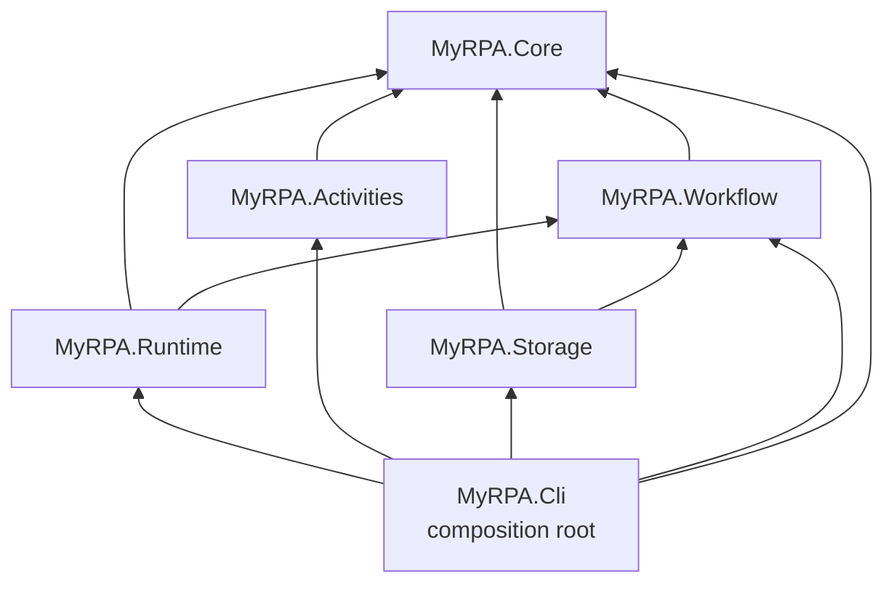

# Phase 1 — Architecture Reconciliation (PRD × Phase 0 findings)

Status: Accepted (2026-09-23), written **before** Phase 1 implementation.
Inputs: `MyRPA-PRD.md`, `docs/research/*` (Phase 0), Phase 0 architectural review.
Research codes (R#, D#, N#) refer to `docs/research/openrpa-analysis.md`.

## 1. Conflicts and gaps between the PRD and Phase 0

| # | PRD says | Phase 0 finding | Resolution |
|---|---|---|---|
| C1 | ADRs in `docs/decisions/` (PRD §28–29) | Phase 1 instruction requires `docs/adr/` | Use `docs/adr/` (newer instruction). [ADR-0001](../adr/0001-record-architecture-decisions.md) |
| C2 | Test projects: Core, Workflow, Runtime, Activities, Integration (PRD 1.2) | Boundaries must be *enforced*, not assumed (D5, D6; OpenRPA has no tests) | Add `tests/MyRPA.Architecture.Tests`. Keeps rule tests out of unit/integration projects, which should not reference every assembly. [ADR-0003](../adr/0003-solution-structure-and-dependency-direction.md) |
| C3 | `MyRPA.Activities` holds "Activity" concepts (PRD 2.1) | Contracts assembly must be thin and separate from implementations (D5); OpenRPA plugins inherited the whole host stack | Activity **identity/metadata contracts** (`ActivityTypeName`, `ActivityDescriptor`, `IActivityCatalog`) live in `MyRPA.Core`; `MyRPA.Activities` holds the catalog implementation and (from Phase 2) built-in activities. Future plugins reference Core only. [ADR-0003](../adr/0003-solution-structure-and-dependency-direction.md) |
| C4 | PRD 2.6 JSON example `"type": "Log"` | OpenRPA resolved remote types with `Type.GetType(...)` (N6) and loaded every DLL (N3) | Activity types are **registered names** (`ActivityTypeName`), resolved through an explicit catalog — never CLR type names. Names are namespaced (`Core.Log`, not `Log`) so plugins cannot collide. [ADR-0002](../adr/0002-own-engine-and-versioned-json-workflow-model.md), [ADR-0008](../adr/0008-secure-by-default-baseline.md) |
| C5 | PRD 2.1 names a type `ExecutionContext` | Collides with `System.Threading.ExecutionContext` (BCL, implicitly imported) | Phase 2 should name it `WorkflowExecutionContext`. Phase 1 introduces only `ExecutionIdentity`. Recorded as open item. |
| C6 | PRD 2.6 example has one `"version"` field | A workflow's *content version* and the *schema version* of the file format are different things (D1, D11, PRD 10.6 migrations) | Model carries both `SchemaVersion` and `Version`. [ADR-0002](../adr/0002-own-engine-and-versioned-json-workflow-model.md) |
| C7 | PRD 8: SQLite initially | Phase 1 needs no persistence; OpenRPA's fan-out storage was ambiguous (D11) | `MyRPA.Storage` stays abstraction-only, no database package. Concrete stores come later as separate projects (e.g. `MyRPA.Storage.Sqlite`). |
| C8 | PRD 8: WPF Studio, Windows UIA | Core must stay platform-neutral (D5; PRD 7.1) | All Phase 1 projects target `net10.0`. Future Windows-only projects (Studio, Windows provider) will opt into `net10.0-windows` individually; architecture tests reject `-windows` TFMs, `UseWPF`, `UseWindowsForms` in Core/Workflow/Runtime/Activities/Storage. |
| C9 | PRD 3.1 plugin interfaces | Phase 3 scope; implicit discovery is an OpenRPA anti-pattern (D3) | Not created in Phase 1. Only explicit DI registration exists. |
| C10 | PRD 2.5/Phase 2 runtime features | Durable resume was effectively disabled in OpenRPA (D11) | Out of Phase 1; open question for Phase 2 ADR. |

No PRD requirement is dropped; C2 and C3 refine the structure, the rest are clarifications.

## 2. Boundaries changed because of Phase 0

1. **Activity contracts move to Core** (C3) — thin SDK surface (D5, R10).
2. **Runtime does not reference Activities** — the engine must not depend on the built-in library, so that Studio/Robot/Orchestrator can compose different activity sets (R10, D3). The composition root wires both.
3. **Architecture test project added** (C2).
4. **Composition root is the CLI** (later also Studio/Robot hosts). Only composition roots may reference `Microsoft.Extensions.Hosting` (D6).

## 3. Core vs. infrastructure

| Belongs in `MyRPA.Core` (platform-neutral, zero packages) | Belongs elsewhere |
|---|---|
| Strongly-typed identifiers: `ExecutionId`, `WorkflowId`, `NodeId`, `CorrelationId` | DI registration, logging and tracing plumbing → `MyRPA.Runtime` |
| `ExecutionIdentity` (correlation carrier for logs/traces) | Host building, console logging, commands → `MyRPA.Cli` |
| Diagnostic names (`ActivitySource` name, tag/scope keys) | Activity catalog implementation, built-in activities → `MyRPA.Activities` |
| Activity identity/metadata: `ActivityTypeName`, `ActivityDescriptor`, `IActivityCatalog` | Workflow model → `MyRPA.Workflow` |
| | Persistence abstractions → `MyRPA.Storage`; concrete DBs → future `MyRPA.Storage.*` |
| | Browser/Windows/Office/AI/MCP/Orchestrator → future provider/host projects |

## 4. Final project structure

```text
MyRPA.sln
src/
  MyRPA.Core          net10.0  no package references
  MyRPA.Workflow      net10.0  → Core                      no package references
  MyRPA.Activities    net10.0  → Core                      M.E.DependencyInjection.Abstractions
  MyRPA.Runtime       net10.0  → Core, Workflow            M.E.DependencyInjection.Abstractions, M.E.Logging.Abstractions
  MyRPA.Storage       net10.0  → Core, Workflow            M.E.DependencyInjection.Abstractions
  MyRPA.Cli           net10.0  → all of the above          M.E.Hosting  (composition root, Exe)
tests/
  MyRPA.Core.Tests, MyRPA.Workflow.Tests, MyRPA.Runtime.Tests, MyRPA.Activities.Tests,
  MyRPA.Integration.Tests, MyRPA.Architecture.Tests      xUnit v3 on Microsoft.Testing.Platform
```

## 5. Dependency direction



Rules: arrows point toward more stable, more abstract projects. Nothing references `MyRPA.Cli`.
`src` never references `tests`. The graph is acyclic (verified by test).

## 6. How Core is kept clean

Enforced by `tests/MyRPA.Architecture.Tests` on every build/CI run:

1. **Project graph allow-list** — each `src` project may reference only the projects listed in §5; cycles fail.
2. **Package allow-list** — Core and Workflow: no `PackageReference`/`FrameworkReference`; Activities/Runtime/Storage: only
   `Microsoft.Extensions.*.Abstractions`; only `MyRPA.Cli` may reference `Microsoft.Extensions.Hosting`.
3. **Compiled assembly-reference allow-list** — Core/Workflow may reference only BCL assemblies (`System.*`, `netstandard`).
   A deny-list additionally covers every `src` project: WPF/WinForms/XAML (`PresentationFramework`, `PresentationCore`,
   `WindowsBase`, `System.Windows.Forms`, `System.Xaml`), Playwright, FlaUI, UI Automation, WF4/CoreWF (`System.Activities`),
   database drivers/ORMs (SQLite, SqlClient, EF Core, Npgsql, Dapper, LiteDB), AI SDKs (OpenAI, Anthropic, Azure.AI,
   Semantic Kernel), MCP SDKs.
4. **TFM rule** — Phase 1 `src` projects target exactly `net10.0`; no `UseWPF`/`UseWindowsForms`.
5. **Code rules via reflection/IL** — no `async void`; no mutable static fields; no calls to `Type.GetType(string…)`,
   `Assembly.Load*`, `Activator.CreateInstance(string…)`, `BinaryFormatter` in `src` assemblies.

## 7. Explicit non-goals for Phase 1

No engine execution, no Sequence/If/While, no JSON serializer, no `run`/`validate` commands, no plugin
discovery/manifests/`AssemblyLoadContext`, no providers, no persistence implementation, no credentials store,
no orchestrator, no AI/MCP.
