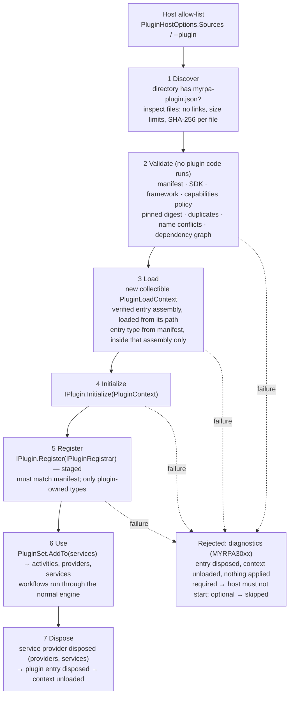
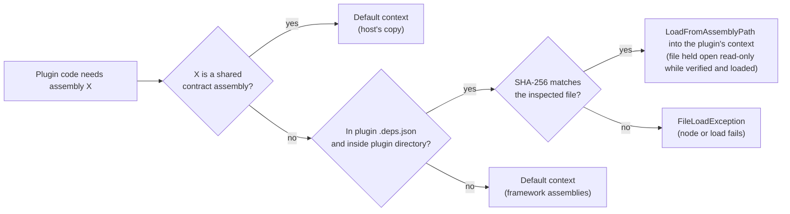

# Plugin system

Status: Phase 3, with assembly loading updated in Phase 4. The decisions behind this document are recorded in
[ADR-0014](../adr/0014-plugin-manifest-lifecycle-and-loading.md) (manifest, lifecycle and loading),
[ADR-0015](../adr/0015-plugin-trust-model.md) (trust model) and
[ADR-0016](../adr/0016-verified-path-based-plugin-loading.md) (verified path-based loading). The contract that plugin code implements is described in
[automation-sdk.md](automation-sdk.md).

> **Security limitation.** Plugins run inside the MyRPA process with the host's full permissions.
> `AssemblyLoadContext` isolates *loading* (dependency versions, unloading); it is **not a security boundary** and not
> a sandbox. Only load plugins you trust as much as MyRPA itself.

## A plugin on disk
A plugin is one directory:

```text
MyRPA.Samples.DemoPlugin/                  <- the directory given to --plugin / PluginSource.Directory
├── myrpa-plugin.json                      <- manifest (required; what makes the directory a plugin)
├── MyRPA.Samples.DemoPlugin.dll           <- entry assembly (manifest entryPoint.assembly)
├── MyRPA.Samples.DemoPlugin.deps.json     <- dependency graph (EnableDynamicLoading)
└── <private dependencies>.dll             <- loaded into the plugin's own context
```

Host contract assemblies (`MyRPA.Core`, `MyRPA.Workflow`, `MyRPA.Sdk`, `Microsoft.Extensions.*.Abstractions`) are
supplied by the host. If the directory contains copies of them, the copies are ignored.

## Manifest

```json
{
  "manifestVersion": "1.0",
  "id": "MyRPA.Samples.Demo",
  "name": "MyRPA demo plugin",
  "version": "1.0.0",
  "description": "Sample plugin: Demo.Echo and Demo.GetField activities over the in-memory Demo.Text provider.",
  "sdkVersion": "1.0",
  "targetFramework": "net10.0",
  "entryPoint": { "assembly": "MyRPA.Samples.DemoPlugin.dll", "type": "MyRPA.Samples.DemoPlugin.DemoPlugin" },
  "capabilities": [],
  "activities": [ "Demo.Echo", "Demo.GetField" ],
  "providers": [ "Demo.Text" ],
  "dependencies": []
}
```

| Field | Required | Rules |
|---|---|---|
| `manifestVersion` | yes | `"1.0"`. Checked first; an unsupported version stops reading (MYRPA3007). |
| `id` | yes | `Namespace.Name` segments of ASCII letters/digits; unique per host, case-insensitive. |
| `name` | yes | Display name. `description` is optional. |
| `version` | yes | `MAJOR.MINOR.PATCH[-prerelease]`. |
| `sdkVersion` | yes | SDK the plugin was built for; host accepts same major, minor ≤ host (MYRPA3008). |
| `targetFramework` | yes | `netX.Y`, `netX.Y-windows[ver]` or `netstandard2.0/2.1`; `X` must not exceed the host runtime; `-windows` loads only on Windows (MYRPA3009). |
| `entryPoint.assembly` | yes | File name of a `.dll` in the directory; no path. |
| `entryPoint.type` | yes | Full name of a public, non-abstract, non-generic, non-nested class implementing `IPlugin` with a public parameterless constructor. |
| `capabilities` | no | `FileSystem`, `Network`, `Process`, `Desktop`, `Clipboard`, `Credentials`, `NativeCode`. Declarative; unknown values are warnings. |
| `activities` | no | Activity type names the plugin registers. Not `Core.*`. Exactly these must be registered. |
| `providers` | no | Provider ids the plugin registers. Exactly these must be registered. |
| `dependencies` | no | `[{ "id": "Other.Plugin", "version": "1.2.0" }]`: requires the same major version and at least that version. |

Every problem in a manifest is reported at once, with its JSON path. Unknown fields are warnings.

## Lifecycle



- Plugins load in dependency order. A plugin whose dependency was rejected is rejected too (MYRPA3014).
- A failing plugin never changes the host: registrations are staged and applied only after the whole set is valid.
- Plugins can **add** services but can never **replace** or decorate host services. Every registered type must be
  defined in the plugin's own load context.

## Assembly loading



| Concern | Behaviour |
|---|---|
| Host/SDK sharing | `MyRPA.Core`, `MyRPA.Workflow`, `MyRPA.Sdk`, `Microsoft.Extensions.DependencyInjection.Abstractions`, `Microsoft.Extensions.Logging.Abstractions` always come from the host, so plugin types implement the host's interfaces. |
| Private dependencies | Resolved from the plugin's `.deps.json`, must be inside the plugin directory, and are loaded into the plugin's context. |
| Dependency conflicts | Two plugins, or a plugin and the host, can use different versions of the same library, as long as its types do not cross the plugin boundary. Types that must cross the boundary belong in the shared list, which needs an ADR to change. |
| Integrity | Each assembly is opened with read-only sharing, re-hashed, compared with the digest taken at discovery, and loaded from its path while still open (ADR-0016). A file changed after verification is refused. On Windows the open handle blocks writers, so the loaded file is the verified file; on Linux/macOS sharing is advisory and a small window remains. |
| `Assembly.Location` | Real path inside the plugin directory, so libraries that find companion files next to themselves (Playwright's driver) work. Loaded files stay locked on Windows until the context unloads. |
| Size limits | 2,048 files / 256 MB per plugin directory. Plugins that bundle native runtimes are built per platform (the Playwright plugin: 124 files, 104 MB on Windows x64). |
| Unloadability | Contexts are collectible and unloaded after disposal. Unloading completes when nothing references plugin code; plugins that leave threads, timers or static roots behind cannot be unloaded. |
| Banned APIs | Only `PluginLoadContext` may call `AssemblyLoadContext.LoadFrom*` or `Assembly.GetType(string)` (architecture tests). |

## Trust model (summary of ADR-0015)

| Control | Status |
|---|---|
| Explicit allow-list of plugin directories (no scanning of app, user or temp folders) | Implemented |
| Manifest, SDK, framework, version and dependency validation before any plugin code runs | Implemented |
| Registration validation (declared names only; plugin-owned types only) | Implemented |
| Integrity pinning: `PluginSource.Sha256` over the whole directory, `RequireIntegrity` policy, per-assembly re-verification | Implemented |
| Declared capabilities + `DeniedCapabilities` policy | Implemented (declarative, not enforced) |
| Signature validation | Not implemented (package management, Phase 12) |
| Process isolation for untrusted plugins | Not implemented (Robot/Orchestrator phases) |

A plugin **cannot** do the following:
- be loaded because a workflow mentions it;
- be discovered by dropping a DLL into a folder;
- register activity names it did not declare, or names in `Core`;
- replace host services;
- load assemblies from outside its directory.

A plugin **can**, like any in-process code, do anything the host process can: files, network, processes,
reflection, native code. Declared capabilities describe intent; they do not enforce it.

## Using plugins

### CLI
```bash
dotnet build samples/plugins/MyRPA.Samples.DemoPlugin
myrpa --plugin samples/plugins/MyRPA.Samples.DemoPlugin/bin/Debug/net10.0 plugins
myrpa --plugin samples/plugins/MyRPA.Samples.DemoPlugin/bin/Debug/net10.0 run samples/plugins/demo-plugin.json --arg customer=Grace
```
- `--plugin <directory>` is repeatable. Plugins named on the command line are required: if one fails, diagnostics go
  to stderr and the exit code is **5**.
- `myrpa plugins` prints each plugin's SHA-256 digest, which is the value to pin.
- `myrpa info` marks plugin activities with `[plugin <id>]`.

### Hosts (code)
```csharp
var options = new PluginHostOptions { RequireIntegrity = true };
options.Sources.Add(new PluginSource { Directory = fullPath, Sha256 = pinnedDigest, Required = false });
await using var plugins = await PluginLoader.LoadAsync(options, cancellationToken);
foreach (var diagnostic in plugins.Diagnostics) { /* report */ }
if (plugins.HasRequiredFailures) { /* do not start */ }

services.AddMyRpaRuntime().AddMyRpaActivities().AddMyRpaPlugins(plugins);
// ... build and use the service provider; dispose it BEFORE disposing `plugins`.
```

## Diagnostics

| Code | Meaning |
|---|---|
| MYRPA3001 | Plugin directory missing, not fully qualified, a link, containing links, or too large |
| MYRPA3002 | No `myrpa-plugin.json` (the directory is not a plugin) |
| MYRPA3003 | Manifest is not valid JSON, not an object, or too large |
| MYRPA3004 / 3005 / 3006 | Missing field / invalid field / unknown field (warning) |
| MYRPA3007 | Unsupported manifest version |
| MYRPA3008 / 3009 | Incompatible SDK / target framework |
| MYRPA3010 | Duplicate plugin id |
| MYRPA3011 / 3012 / 3013 / 3014 | Dependency missing / incompatible version / cycle / rejected |
| MYRPA3015 / 3016 | Digest does not match the pin / pin required but missing |
| MYRPA3017 | Declared capability denied by host policy |
| MYRPA3018 | Entry assembly or type missing or unusable |
| MYRPA3019 | Loading failed (bad image, missing dependency, ...) |
| MYRPA3020 / 3021 | `Initialize` failed / `Register` failed or invalid registrations |
| MYRPA3022 | Activity or provider name reserved (`Core`) or declared by another plugin |
| MYRPA3023 | Disposing the plugin failed (warning) |

## Writing a plugin
1. Create a class library targeting `net10.0` with `<EnableDynamicLoading>true</EnableDynamicLoading>`. Reference
   `MyRPA.Sdk` with `Private="false" ExcludeAssets="runtime"`, because the host supplies it.
2. Implement `IPlugin`. `Initialize` validates settings; `Register` registers exactly the activities and providers
   declared in the manifest.
3. Put resources with an explicit owner: run services for per-run sessions, plugin services or providers for shared
   clients. Never store them in activity fields.
4. Add `myrpa-plugin.json` to the output (`CopyToOutputDirectory`).
5. Load it with `--plugin <output directory>`, then pin the digest shown by `myrpa plugins`.

See `samples/plugins/MyRPA.Samples.DemoPlugin/` for a complete, tested example.
