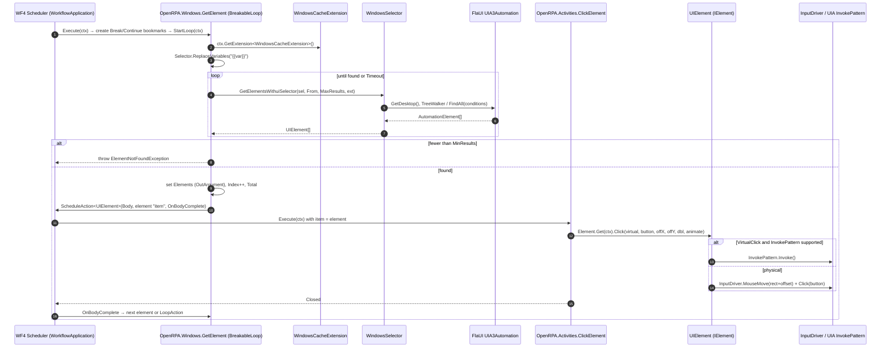

# OpenRPA — Activities and the Workflow Designer

All paths relative to `reference/openrpa/` (commit `b78115e`).

## 1. OpenRPA is built directly on Windows Workflow Foundation 4

Observed: OpenRPA does **not** define its own activity abstraction. Every activity is a
`System.Activities` type. OpenRPA adds a few reusable base classes and conventions.

| Base | Origin | Used for | Example |
|---|---|---|---|
| `CodeActivity` | WF4 | Synchronous, short actions | `OpenRPA.Activities.ClickElement` (`OpenRPA/Activities/ClickElement.cs`), `TypeText` |
| `CodeActivity<T>` / `NativeActivity<T>` | WF4 | Actions returning a value | `ExcelActivityOf<TResult>` (`OpenRPA.Office/Activities/ExcelActivity.cs:244`) |
| `NativeActivity` | WF4 | Activities that schedule children / bookmarks | `InvokeOpenRPA`, `InvokeRemoteOpenRPA`, `Detector` |
| `BreakableLoop : NativeActivity` | OpenRPA (`OpenRPA.Interfaces/BreakableLoop.cs`) | "Find elements then run Body for each", supports `Break`/`Continue` via bookmarks | `OpenRPA.Windows.GetElement`, `OpenRPA.NM.GetElement` |
| `AsyncTaskCodeActivity(<T>) : AsyncCodeActivity(<T>)` | OpenRPA (`OpenRPA.Interfaces/AsyncTaskCodeActivity.cs`) | Bridges `Task`-based code to WF4 Begin/End pattern | `Workitems.PopWorkitem` (`OpenRPA/Activities/Workitems/PopWorkitem.cs:20`) |
| `AsyncTaskNativeActivity`, `AsyncNativeActivity` + `BookmarkResumptionHelper : IWorkflowInstanceExtension` | OpenRPA (`OpenRPA.Interfaces/AsyncNativeActivity.cs`) | Async work that resumes a bookmark when done | — |
| `IActivityTemplateFactory` | WF4 designer | Drag-drop templates that pre-build a subtree | `GetElement.Create()` builds `GetElement { Body = ActivityAction<UIElement>{ Argument="item", Handler=ClickElement } }` |

## 2. Anatomy of an activity (Observed from `ClickElement`)

```text
[Designer(typeof(ClickElementDesigner))]                  → WPF designer (XAML) for canvas
[ToolboxBitmap(...), LocalizedToolboxTooltip, LocalizedDisplayName, LocalizedHelpURL]
public class ClickElement : CodeActivity
    InArgument<IElement> Element  (default expression: VisualBasicValue<IElement>("item"))
    InArgument<bool>     AnimateMouse, Focus, DoubleClick, VirtualClick
    InArgument<int>      Button, OffsetX, OffsetY
    InArgument<TimeSpan> PostWait
    InArgument<string>   KeyModifiers  [Editor(KeyModifiersOptionsEditor)]
    Execute(CodeActivityContext ctx):
        el = Element.Get(ctx)                      ← the automation element from parent loop
        FlaUI.Core.Input.Keyboard.Pressing(modifiers)
        el.Click(virtualClick, button, OffsetX, OffsetY, doubleclick, animatemouse)
        Thread.Sleep(postwait)
```

Observed conventions:
- **Properties** are WF4 `InArgument<T>` / `OutArgument<T>` / `InOutArgument<T>`; defaults often come
  from `Config.local` in the constructor (e.g. `VirtualClick = Config.local.use_virtual_click`).
- **Arguments vs variables**: workflow-level arguments are `DynamicActivityProperty` entries on the
  `ActivityBuilder`, exposed as `Workflow.Parameters` (name/type/direction). Variables are WF4
  `Variable<T>` on scopes (`Sequence.Variables`, `BreakableLoop.Variables`).
- **Loop context variables**: `GetElement` activities add `Index` and `Total` `Variable<int>` and update
  them via `BreakableLoop.IncIndex/SetTotal` using `context.DataContext.GetProperties()`.
- **Element flow**: finder activities pass the found element to children through
  `ActivityAction<UIElement>` with a `DelegateInArgument` named **`item`**; child activities default their
  `Element` argument to the VB expression `item`.
- **Selector variables**: `{{name}}` placeholders in selector strings are substituted from the workflow
  data context at runtime by `Selector.ReplaceVariables` (`OpenRPA.Interfaces/Selector/Selector.cs`).
- **Expressions**: Visual Basic (`Microsoft.VisualBasic.Activities.VisualBasicValue/Reference`), compiled on
  load (`ActivityXamlServicesSettings.CompileExpressions = true`, `Workflow.cs:541`).
- **CacheMetadata**: `Interfaces.Extensions.AddCacheArgument(metadata, "Selector", Selector)` etc. plus
  `metadata.AddImplementationVariable(...)` (`OpenRPA.Windows/Activities/GetElement.cs`).
- **Workflow extensions**: activities obtain per-run services with `context.GetExtension<T>()`, e.g.
  `WindowsCacheExtension` (an `ICustomWorkflowExtension` registered by plugin discovery) that holds a
  shared `UIA3Automation`.
- **Localization**: `Localized*Attribute` + `Resources.strings` resx per project.

## 3. Activity lifecycle (as run by WF4)

1. `CacheMetadata` (at first run / validation) declares arguments, children, implementation variables.
2. `Execute(context)` is invoked by the WF4 scheduler.
3. `CodeActivity` returns; `NativeActivity` may `ScheduleActivity`, `ScheduleAction<T>(Body, arg, onCompleted)`,
   `CreateBookmark(name, callback)` → instance goes **Idle** until `ResumeBookmark`.
4. Exceptions propagate to enclosing `TryCatch` or terminate the instance (see runtime doc).
5. Tracking records emitted for each state (`Executing`, `Closed`, `Faulted`, `Canceled`).

### Diagram 3 — Activity execution (Windows GetElement → ClickElement)



## 4. How the designer represents activities

- Host: `OpenRPA.Views.WFDesigner` (`OpenRPA/Views/WFDesigner.xaml.cs`) wraps
  `System.Activities.Presentation.WorkflowDesigner` (`new WorkflowDesigner()` line 302; `new DesignerMetadata().Register()` line 1970).
- Load: `WorkflowDesigner.Text = Workflow.Xaml; WorkflowDesigner.Load();` (line 324). Save: `Workflow.Xaml = WorkflowDesigner.Text` after `Flush()` (lines 496, 508).
- Model: activities on canvas are WF4 `ModelItem`s; edits use `ModelService` + `ModelEditingScope`
  (`AddActivity`, line 802). Each activity type supplies its own WPF `ActivityDesigner` via `[Designer]`.
- Property grid: WF4 property inspector; custom editors via `[Editor(typeof(...), typeof(ExtendedPropertyValueEditor))]`
  (e.g. `CustomSelectEditor`, `ArgumentCollectionEditor`).
- Some activities register designer metadata imperatively through `AttributeTableBuilder` + `MetadataStore.AddAttributeTable`
  (e.g. `OpenRPA/Activities/InvokeOpenRPA.cs:24`).

## 5. How activities are registered (toolbox)

Observed in `WFToolbox.InitializeActivitiesToolbox()` (`OpenRPA/Views/wfToolbox.xaml.cs:51`):
- Iterate **all non-dynamic assemblies in the AppDomain**; for each, build a `ToolboxCategory` named after the assembly.
- Include every exported, public, non-nested, non-abstract type with a parameterless ctor that is a subclass of
  `Activity`, `NativeActivity`, `CodeActivity`, `AsyncCodeActivity`, `ActivityWithResult`, `DynamicActivity`,
  `FlowNode`, `State`/`FinalState`, or implements `IActivityTemplateFactory`.
- Exclude a hard-coded deny-list (e.g. `Assign\`1`, `ForEach\`1`, generic arithmetic, `ExcelActivity`, `Statements.While`)
  and types from `Snippets.dll`.
- Special-case: if assembly `OpenRPA.Script` is loaded, reflectively call `ScriptActivities.LoadScriptActivities()` for extra categories.

Analysis: there is **no explicit activity registration API**. Whatever is loaded into the AppDomain and
looks like an activity appears in the toolbox. Loading a plugin = registering its activities.

## 6. Events inside workflows

- `Detector` activity (`OpenRPA/Activities/Detector.cs:29`) creates bookmark `"detector_" + detectorId`
  and idles; `MainWindow.OnDetector` resumes it when the detector plugin fires (see orchestration doc).
- `InvokeOpenRPA` (local sub-workflow) creates a bookmark named after the child instance `_id` and resumes on child completion
  (`OpenRPA/Activities/InvokeOpenRPA.cs:141-176`).
- `InvokeRemoteOpenRPA` sends a `RobotCommand` to another robot's queue with `replyto = RobotInstance.robotqueue`,
  `correlationId = bookmarkname`, and waits on that bookmark (`InvokeRemoteOpenRPA.cs:116, 133`).

## 7. Activity inventory (selected, Observed)

| Area | Activities |
|---|---|
| Core (`OpenRPA`) | `ClickElement`, `TypeText`, `FocusElement`, `HighlightElement`, `MoveElement`, `MoveMouse`, `OpenApplication`, `CloseApplication`, `CopyClipboard`, `InsertClipboard`, `ForEachDataRow`, `ForEachOf`, `BreakableWhile`, `BreakableDoWhile`, `Break`, `Continue`, `CommentOut`, `Detector`, `GetWorkflowInstance`, `InvokeOpenRPA`, `InvokeRemoteOpenRPA`, `InvokeOpenFlow`, `ShowBalloonTip`, `StopOpenRPA` |
| Work items | `AddWorkitem`, `BulkAddWorkitems`, `PopWorkitem`, `UpdateWorkitem`, `DeleteWorkitem`, `ThrowBusinessRuleException` |
| Windows | `GetElement`, `GetWindows`, `CloseWindow` |
| Browser (NM) | `GetElement`, `OpenURL`, `GetTab`, `CloseTab`, `ExecuteScript`, `GetTable`, `WaitForDownload` |
| Office | Excel `ReadCell/WriteCell/ReadRange/WriteRange/InsertRange/ClearRange/GetSelectedRange/RunExcelMacro/Protect/UnprotectWorksheet/CloseWorkbook/ExportWorkbook`; Word `AddParagraph/GetParagraph/SetParagraph/CloseDocument/ExportDocument`; Outlook `GetMails/NewMailItem/ReplyMailItem/MoveMailItem/SaveMailItem`; PowerPoint `RunSlideShow` |
| Script | `InvokeCode` (VB, C#, PowerShell, AutoHotkey, Python), `PipInstall` |

## MyRPA implication

- **Retain the concept**: "finder activity with a body scoped to the found element" (`GetElement` + `item`)
  is a strong, readable pattern for UI automation and composes well with recording.
- **Retain the concept**: argument/variable model with In/Out/InOut direction and typed values.
- **Redesign**: activities are tied to WF4 base classes, VB expressions, WPF designer attributes, and
  `Config.local` defaults in constructors. MyRPA activities should be plain, UI-free definitions with
  metadata (display name, category, property schema) declared as data, and a separate designer layer.
- **Redesign**: activity registration by "everything loaded in the AppDomain" → explicit registration by
  plugin manifest/registry.
- **Redesign**: `Thread.Sleep` and synchronous blocking inside activities (`PostWait`, polling loops) →
  async execution with `CancellationToken`.
