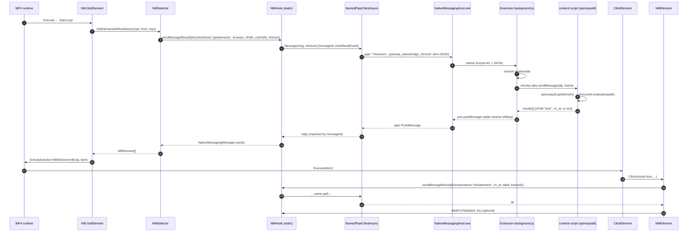

# OpenRPA — Browser Automation and Native Messaging

All paths relative to `reference/openrpa/` (commit `b78115e`).

## 1. Components and process boundaries

```text
┌──────────────────── OpenRPA.exe ────────────────────┐     ┌── OpenRPA.NativeMessagingHost.exe ──┐     ┌──────── Browser (Chrome/Edge/Firefox) ────────┐
│ NM.GetElement / ClickElement / OpenURL / ...        │     │ (one per browser, started by browser)│     │ Extension "openrpa" (Manifest V2)            │
│   → NMSelector / NMElement                          │     │                                      │     │  background.js (bootstrap)                   │
│   → NMHook (static)                                 │     │  messagehandler: stdin ↔ JSON        │     │    eval(script from host) ← "backgroundscript"│
│   → NamedPipeClientAsync<NativeMessagingMessage>    │◄───►│  NamedPipeServer<NativeMessagingMsg> │◄───►│  content.js (bootstrap in every frame)       │
│      pipe "<SessionId>_openrpa_nativebridge_<b>"    │ pipe│  "<SessionId>_openrpa_nativebridge_  │stdio│    eval(jquery+libs+openrpautil) ← "loadscript"│
│                                                     │     │   <browser>"                         │     │  openrpautil[functionName](message)          │
└─────────────────────────────────────────────────────┘     └──────────────────────────────────────┘     └──────────────────────────────────────────────┘
```

| Component | Project | Class / File | Responsibility |
|---|---|---|---|
| Browser plugin | OpenRPA.NM | `Plugin : IRecordPlugin` (`OpenRPA.NM/Plugin.cs`) | Registers native host in registry, starts pipe clients, handles recording (`ParseUserAction`, `OnMessage`) |
| Pipe client + tab/window cache | OpenRPA.NM | `NMHook` (static) (`OpenRPA.NM/NMHook.cs`) | `checkForPipes(chrome, ff, edge)`, `sendMessageResult(msg, timeout)`, `getElement`, `openurl`, `selecttab`, `CloseTab`, `ExecuteScript`, `WaitForTab`, registry registration |
| Element | OpenRPA.NM | `NMElement : IElement` (`OpenRPA.NM/NMElement.cs:14`) | Wraps a `NativeMessagingMessage` result: xpath, cssselector, tagname, id, classnames, zn_id, rect; `Click`, `Value` get/set, `Focus`, `Highlight` |
| Selector | OpenRPA.NM | `NMSelector`, `NMSelectorItem` | See [openrpa-selectors.md](openrpa-selectors.md) |
| Activities | OpenRPA.NM | `GetElement`, `OpenURL`, `GetTab`, `CloseTab`, `ExecuteScript`, `GetTable`, `WaitForDownload` | Workflow surface |
| Detectors | OpenRPA.NM | `URLDetectorPlugin`, `DownloadDetectorPlugin` | Trigger on URL/download events from the extension |
| Message DTO | OpenRPA.Interfaces | `NativeMessagingMessage : PipeMessage` (`OpenRPA.Interfaces/NativeMessagingMessage.cs`) | `messageid`, `functionName`, `browser`, `tabid`, `windowId`, `frameId`, `xPath`, `cssPath`, `fromxPath`, `fromcssPath`, `zn_id`, `x/y/width/height`, `uix/uiy/uiwidth/uiheight`, `data`, `script`, `result`, `results[]`, `tab`, `error`, `debug`, `uniquexpathids` |
| Native host | OpenRPA.NativeMessagingHost | `Program`, `messagehandler` | 4-byte LE length + UTF-8 JSON over stdin/stdout; relays to/from named pipe; serves embedded JS |
| Pipe transport | OpenRPA.NamedPipeWrapper | `NamedPipeServer<T>`, `NamedPipeClient<T>`, `PipeStreamWriter/Reader` | Length-prefixed (network byte order) **JSON** frames (`PipeStreamWriter.WriteObject`, `JsonConvert.SerializeObject`) |
| Extension | OpenRPA.NativeMessagingHost/addon, addon2 | `manifest.json`, `background.js`, `content.js` | MV2, permissions `tabs`, `nativeMessaging`, `<all_urls>`, `webNavigation`, `downloads`; content script in all frames at `document_start` |
| Page runtime | OpenRPA.NativeMessagingHost | `openrpautil.js`, `libs.js`, `jquery.js`, `background.js` (full) | Embedded resources, delivered at runtime to the extension |

## 2. Native messaging protocol (Observed)

- Host registration: `NMHook.registreChromeNativeMessagingHost(localMachine:false)` writes
  `HKCU\SOFTWARE\Google\Chrome\NativeMessagingHosts\com.openrpa.msg` pointing to `chromemanifest.json`, whose
  `path` is rewritten to `<PluginsDirectory>\OpenRPA.NativeMessagingHost.exe` (`NMHook.cs:1107`). Similar for Firefox.
  Manifest `name: "com.openrpa.msg"`, `type: "stdio"`, fixed `allowed_origins` list of extension IDs.
- Browser → host framing: `messagehandler` reads 4-byte length then UTF-8 JSON, deserializes `NativeMessagingMessage`
  (`OpenRPA.NativeMessagingHost/messagehandler.cs`). Host → browser: `OpenStandardStreamOut` writes 4-byte length + JSON.
- Host lifecycle: started by the browser when the extension calls `chrome.runtime.connectNative('com.openrpa.msg')`.
  On the first message carrying `browser`, the host creates `NamedPipeServer` named
  `"{SessionId}_openrpa_nativebridge_{browser}"` (`Program.cs`). A 5 s timer sends `ping` to the browser.
  Host exits when stdin returns empty.
- **Script bootstrap**: the installed extension is a thin loader. `addon/background.js` asks the host for
  `"backgroundscript"` and runs it with `eval.call(window, message.script)`; `addon/content.js` asks the background for
  `"loadscript"` and `eval`s the returned bundle (`jquery + libs + openrpautil`). The host serves these from embedded
  resources (`messagehandler.loadscript`).
- Request/response correlation: `PipeMessage.messageid` (random-seeded counter). `NamedPipeClientAsync.Message/MessageAsync`
  pushes the message, registers a `queuemsg` in `replyqueue`, waits on an `AutoResetEvent` with timeout, and throws
  `NamedPipeException` if `error` is set (`OpenRPA.NM/pipe/NamedPipeClientAsync.cs`).
- Unsolicited events from browser: `windowcreated/removed/focus`, `tabcreated/updated/removed/activated`,
  `downloadcomplete`, `mousemove`, `click`, `keydown/keyup` → `NMHook.Client_OnReceivedMessage` updates tab/window
  caches and raises `NMHook.onMessage`.
- Dispatch in the page: `background.js` routes by `functionName` (tab/window ops handled in background; everything else
  → `SendToTab` → `chrome.tabs.sendMessage` per frame); content `runtimeOnMessage` calls `openrpautil[functionName](message)`
  (`openrpautil.js:100-126`), e.g. `getelements`, `getelement`, `clickelement`, `focuselement`, `updateelementvalue(s)`,
  `executescript`. Background adds window `left/top` to `uix/uiy` for screen coordinates.

## 3. Trace: browser activity from workflow to page

1. `OpenRPA.NM.GetElement.StartLoop` (`OpenRPA.NM/Activities/GetElement.cs`) optionally `NMHook.WaitForTab(...)`, then
   `NMSelector.GetElementsWithuiSelector(sel, from, maxresults)` in a timeout loop; throws `ElementNotFoundException`;
   `context.ScheduleAction<NMElement>(Body, element, OnBodyComplete)`.
2. `NMSelector.GetElementsWithuiSelector` builds `NativeMessagingMessage("getelements")` with `browser`, `xPath`, `cssPath`,
   anchor `fromxPath/fromcssPath/tabid/frameId` → `NMHook.sendMessageResult(msg, PluginConfig.protocol_timeout)`.
3. `NMHook.sendMessageResult` picks `chromepipe` / `ffpipe` / `edgepipe` by `message.browser` → `NamedPipeClientAsync.Message`.
4. Host `Server_OnReceivedMessage` → `handler.sendMessage(message)` → stdout frame → extension background.
5. Background resolves window/tab → `SendToTab` → content script in each frame → `openrpautil.getelements` →
   `document.evaluate(xpath)` / CSS → result `{xPath:"true", uix, uiy, ..., zn_id}` → back via `fnResponse` →
   `port.postMessage` → host stdin → `pipe.PushMessage` → `NMHook` reply queue → `NMElement[]`.
6. Child `ClickElement.Execute` → `NMElement.Click(virtualClick, ...)` (`NMElement.cs:570`):
   - **physical**: `InputDriver.MouseMove(Rectangle + offset)` + `InputDriver.Click` (screen coords from `uix/uiy`);
   - **virtual**: `NativeMessagingMessage("clickelement"){ zn_id, tabid, frameId }` → same pipe path → `openrpautil.clickelement`
     dispatches DOM click; optional `NMHook.WaitForTab(tabid, 5s)`.

### Diagram 7 — Browser automation



## 4. Browser recording

- Content script posts `mousemove` messages with `xpath`, `cssPath`, and UI rect; `NM.Plugin.OnMessage` keeps the
  latest as `LastElement = new NMElement(message)` (`OpenRPA.NM/Plugin.cs:170`).
- When the Windows recorder reports a click, `NM.Plugin.ParseUserAction` claims it if the process is
  `chrome`/`msedge`/`firefox` and the pipe is connected (shows a `MessageBox` if the extension isn't installed),
  detects HTML/div tables (→ `GetTable`) or builds `NMSelector(LastElement)` + `NM.GetElement`.
- A `click` message from the page while `IsRecording` produces a `RecordEvent` directly (`Plugin.cs:199-230`).

## 5. Browser lifecycle activities

- `OpenURL` → `NMHook.openurl(browser, url, newtab, profile, profilepath)`: if connected, sends `openurl`; otherwise starts
  the browser process (`chromeopenurl`, `ffopenurl`, `edgeopenurl`).
- Tabs are tracked in `NMHook` static lists; `GetTab`, `CloseTab`, `selecttab`, `updatetab` operate on `NativeMessagingMessageTab`.

## MyRPA implication

- **Retain (concepts)**: browser elements implement the same `IElement` contract as desktop elements, so generic
  activities (click/type/get value) work across providers; selector anchored in a found element; in-page
  element identity handle (`zn_id`) to avoid re-resolving.
- **Replace**: the extension + native host + named pipe chain. PRD selects **Playwright**: it gives
  in-process request/response over CDP/WebDriver BiDi, built-in auto-waiting, frames, downloads,
  multiple locator strategies, and isolated contexts — no registry writes, no extension install, no
  custom JSON protocol. (Attaching to the user's existing browser session is the main thing the extension
  approach provided; Playwright `ConnectOverCDP` covers Chromium-based browsers — to be validated in Phase 4.)
- **Avoid**: extensions that `eval` code received at runtime from a local process (see analysis doc, security);
  Manifest V2 (being retired by Chromium); coordinate arithmetic for DPI/window offsets (`compensate_for_old_addon`,
  `uiy += 158` at 125 % DPI in `NM.Plugin.OnMessage`).
