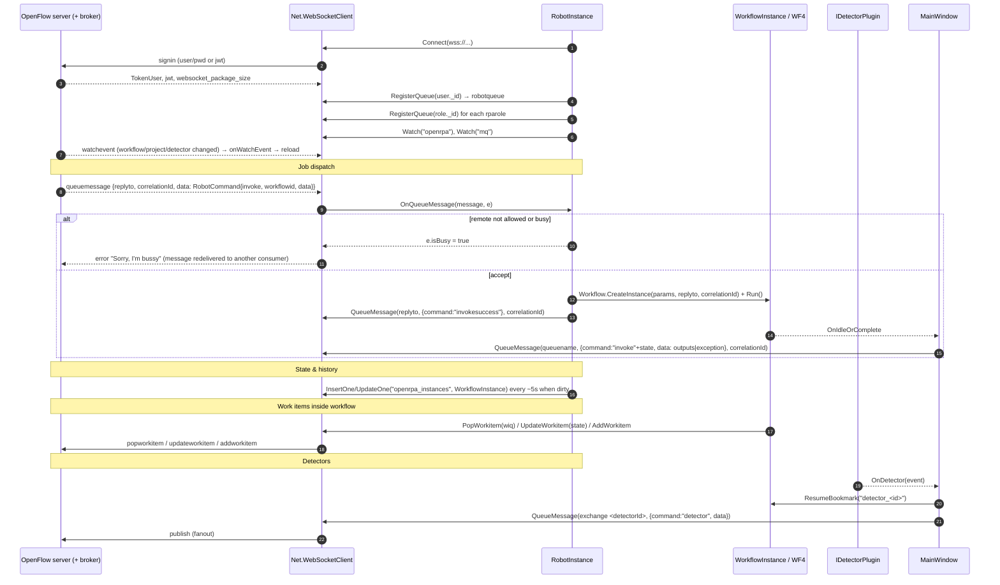

# OpenRPA — Orchestration, Work Items, Events/Detectors, Remote Execution

All paths relative to `reference/openrpa/` (commit `b78115e`).

Scope note: the orchestrator is **OpenFlow** (OpenIAP), a separate server product (Node.js; MongoDB and RabbitMQ
are implied by the API shape — collections, `_id`, `E11000 duplicate key` handling, exchanges/queues — **Not confirmed**
from source because the server is not in this repository). Everything below is the robot/client side.

## 1. Transport: `OpenRPA.Net.WebSocketClient`

| | |
|---|---|
| Project | OpenRPA.Net |
| Class | `WebSocketClient : IWebSocketClient` (`OpenRPA.Net/WebSocketClient.cs`), singleton via `Get(url)`; host stores it in `global.webSocketClient` |
| Wire | `System.Net.WebSockets.ClientWebSocket`; JSON `Message { id, replyto, command, data }` (`BaseMessage.cs`); outbound messages split into `websocket_package_size` (default 4096, server can raise via `refreshtoken`) chunks as `SocketMessage { count, index, priority }` (`Message.cs:42`, `SocketMessage.cs`) |
| Request/response | `SendMessage(Message)` enqueues with `AutoResetEvent`; `Process(msg)` matches `msg.replyto == queued.id` (`WebSocketClient.cs:457`) |
| Server-initiated | `ping` → `pong`; `refreshtoken` (updates `user`, `jwt`); `queueclosed` → `OnQueueClosed`; `queuemessage` → `OnQueueMessage(QueueMessage, QueueMessageEventArgs)`; `watchevent` |
| API (selected) | `Signin(user, SecureString pwd | jwt)`, `RegisterQueue`, `RegisterExchange`, `QueueMessage(queue|exchange, data, replyto, correlationId, expiration, striptoken, traceId, spanId)`, `Query/Count/InsertOne/UpdateOne/InsertOrUpdateOne/DeleteOne/DeleteMany/InsertMany`, `Watch/UnWatch`, `UploadFile/DownloadFile`, `CreateWorkflowInstance` (Node-RED), `EnsureNoderedInstance`, `PushMetrics`, work-item APIs (`AddWorkitem(s)`, `PopWorkitem`, `UpdateWorkitem`, `DeleteWorkitem`, `Add/Update/DeleteWorkitemQueue`) |
| Tracing | Every call carries `traceId`/`spanId` for OTel correlation |

Reconnect: `RobotInstance.Connect()` with linear backoff +5 s up to 120 s (`RobotInstance.cs:1536`).

## 2. Robot identity and queues

`RobotInstance.RegisterQueues()` (`RobotInstance.cs:1863`), called after sign-in:
- Skips registration when running in a Windows **child session** that is not RDP/console (to avoid double robots).
- `robotqueue = RegisterQueue(user._id)` — the robot listens on a queue named after its **user id**.
- For every role of the user whose `apirole.rparole == true`, `RegisterQueue(role._id)` — **role queues** give
  load-balancing across robots sharing a role (competing consumers).

## 3. Receiving jobs: `WebSocketClient_OnQueueMessage`

`RobotInstance.WebSocketClient_OnQueueMessage(IQueueMessage message, QueueMessageEventArgs e)` (`RobotInstance.cs:1557`):
1. Deserialize `message.data` → `Interfaces.mq.RobotCommand { command, workflowid, flowid, nodeId, detectorid, killexisting, killallexisting, traceId, spanId, data }`.
2. **Replies to this robot's own remote calls** (`invokecompleted|invokefailed|invokeaborted|error|timeout`) with
   `correlationId` → find a running instance with a bookmark named `correlationId` → `ResumeBookmark(...)` or `Abort(error)`.
3. `data.payload` unwrapping.
4. `killallworkflows` / `killworkflow` → abort instances if `Config.local.remote_allowed_killing_any`.
5. `invoke` + `workflowid`:
   - `remote_allowed == false` → `e.isBusy = true` (let the message expire so another robot in the role takes it).
   - Concurrency policy: counts running non-`background` instances; if busy and `!remote_allow_multiple_running`
     (or over `remote_allow_multiple_running_max`) → `e.isBusy = true`. `killexisting`/`killallexisting` abort first.
   - Map `data` keys to workflow parameters by name, coercing JSON types (int/float/bool/date/timespan/array/object,
     `DataTable` from `JArray`, `IWorkitem` → `Workitem`, typed arrays via `Type.GetType(p.type)`).
   - On UI thread: `workflow.CreateInstance(param, message.replyto, message.correlationId, IdleOrComplete, ...)`,
     set `TraceId/SpanId`, `Run()` (through the designer if the workflow is open, to get visual tracking).
   - Reply `invokesuccess` (or `error`) to `message.replyto` with the same `correlationId`.
6. Transport-level `e.isBusy` makes `WebSocketClient` reply `error: "Sorry, I'm bussy"` so the broker can redeliver.

## 4. Reporting results

- On idle/complete, `WFDesigner.IdleOrComplete` / `MainWindow.IdleOrComplete` send
  `RobotCommand { command = "invoke" + instance.state, workflowid, data = Parameters | Exception }` to
  `instance.queuename` with `instance.correlationId` (`OpenRPA/Views/WFDesigner.xaml.cs:1235-1251`).
- Execution state/history: `WorkflowInstance` entities saved (every 5 s when dirty) to local storage and to the
  OpenFlow collection **`openrpa_instances`** (unless `skip_online_state`) via `LocallyCached.Save<T>`.
  Fields include `state`, `errormessage`, `errorsource`, `Parameters`, `Bookmarks`, `owner`, `host`, `fqdn`,
  `xml` (persisted WF state), `console` (log lines).
- Metrics/traces: OTLP exporters (`RobotInstance.InitializeOTEL`), `openrpa_workflow_run_count` counter,
  per-activity duration histogram, `PushMetrics` API.

## 5. Robot → robot / robot → server invocation

| Activity | File | Mechanism |
|---|---|---|
| `InvokeRemoteOpenRPA` | `OpenRPA/Activities/InvokeRemoteOpenRPA.cs:42-133` | `QueueMessage(target robot/role queue, RobotCommand{invoke}, replyto = RobotInstance.robotqueue, correlationId = bookmarkname, expiration)`; if `waitforcompleted`, `CreateBookmark(bookmarkname)` → resumed by §3 step 2 |
| `InvokeOpenFlow` | `OpenRPA/Activities/InvokeOpenFlow.cs:117-164` | `QueueMessage(<workflow queue>, payload, replyto = robotqueue, correlationId = bookmark)` to a Node-RED flow; waits on bookmark |
| `InvokeOpenRPA` | `OpenRPA/Activities/InvokeOpenRPA.cs:141-176` | Local sub-workflow: `workflow.CreateInstance(..., ident+1)`, bookmark `instance._id` |

## 6. Work items (queues of business items)

- Model: `IWorkitem` (`wiqid`, `wiq`, `state`, `payload: Dictionary<string,object>`, `retries`, `priority`, `files[]`,
  `lastrun`, `nextrun`, `errormessage`, `errorsource`, `errortype`, `success_wiq(id)`, `failed_wiq(id)`) and
  `IWorkitemQueue` (`workflowid`, `robotqueue`, `amqpqueue`, `maxretries`, `retrydelay`, `initialdelay`, success/failed chaining)
  in `OpenRPA.Interfaces/IWorkitem.cs`.
- Activities: `AddWorkitem`, `BulkAddWorkitems`, `PopWorkitem` (`AsyncTaskCodeActivity` → `webSocketClient.PopWorkitem<Workitem>(wiq, wiqid)`),
  `UpdateWorkitem` (set state successful/retry/failed, files, `ignoremaxretries`), `DeleteWorkitem`, `ThrowBusinessRuleException`.
- Queues are stored in OpenFlow collection **`mq`**; items in **`workitems`**; watched for changes (`Watch("mq", ...)`).
- A work-item queue can be linked to a workflow + robot queue (`workflowid`, `robotqueue`) so that the server
  triggers the robot when items arrive — server-side behaviour **Not confirmed** (server not in repo).

## 7. Events, detectors, triggers

- Entity: `Detector : LocallyCached, IDetector` (`OpenRPA/Detector.cs`) with `Plugin` (type name), `detectortype`
  (default `"exchange"`), `Properties` (plugin-specific config).
- Start: `Detector.Start(doRegisterExchange)` → `Plugins.AddDetector(client, this)` → `IDetectorPlugin.Initialize(client, entity)`
  → subscribe `OnDetector += Window.OnDetector` → `Start()`. When online (OpenFlow ≥ 1.3.103) `RegisterExchange(entity._id, "fanout")`.
- Fire: `MainWindow.OnDetector` (`MainWindow.xaml.cs:3414`):
  1. Start OTel span "Detector <name> was triggered".
  2. Resume any local instance waiting on bookmark `"detector_" + id` (the `Detector` activity).
  3. If connected: publish `RobotCommand { command = "detector", detectorid, data = event }` to the detector's
     exchange (fanout) or queue — so OpenFlow / Node-RED / other robots can react.
- Workflow-level triggers therefore are: (a) the `Detector` activity waiting inside a running workflow, (b) server-side
  subscribers to the detector exchange that then send `invoke` to a robot queue.
- Scheduling (cron/interval) is **not** implemented in the robot; it is expected server-side (Node-RED/OpenFlow) — Not confirmed.

## 8. Local remote-control surface (IPC)

- `OpenRPAServiceUtil` / `OpenRPAService : MarshalByRefObject` (`OpenRPA.Interfaces/IPCService/OpenRPAService.cs`):
  **.NET Remoting** `IpcServerChannel` with `BinaryServerFormatterSinkProvider { TypeFilterLevel = Full }`,
  `authorizedGroup` = BUILTIN\Users (`S-1-5-32-545`), `exclusiveAddressUse=false` (lines 55-80).
- Methods: `RunWorkflowByIDOrRelativeFilename(id, WaitForCompleted, Arguments)`, `KillAllWorkflows`, `KillWorkflows(id)`,
  `ParseCommandLineArgs`, `Ping`. Used by the second-instance command line (`-workflowid`) and by the PowerShell module `OpenRPA.PS`.

## 9. Unattended execution: RDService

- `OpenRPA.RDService` (Windows service): signs in to OpenFlow, upserts an `unattendedserver` document for this machine in
  collection `openrpa`, watches for `unattendedclient` documents for this machine, and for each keeps a user session alive
  with FreeRDP (`RobotUserSession`, `RdpClient`), so that `OpenRPA.exe` runs inside a real interactive desktop
  (`OpenRPA.RDService/Program.cs:210-301`). Credential handling for these sessions not read in depth — Not confirmed.

### Diagram 9 — Robot / orchestrator communication

## MyRPA implication

- **Retain (concepts)**: robot identity = queue; role/pool queues for load-balancing via competing consumers;
  `correlationId` + `replyto` request/response over messaging; explicit "busy → decline so another robot takes it";
  work items with retries, priority, next-run, success/failed queue chaining, business-vs-system exceptions;
  detectors publishing events that the orchestrator can route to jobs; trace context propagated end-to-end.
- **Redesign**: replace the bespoke WebSocket JSON protocol + generic DB CRUD (robots can query/insert arbitrary
  collections) with an **API-first orchestrator** (typed REST/gRPC for control + a job/lease protocol for robots),
  server-side scheduling and queue semantics, and least-privilege robot credentials.
- **Avoid**: robot-side ad-hoc parameter type coercion via `Type.GetType(p.type)` from remote input; `remote_allowed`
  defaulting to `true`; .NET Remoting with `TypeFilterLevel.Full` for local control.
