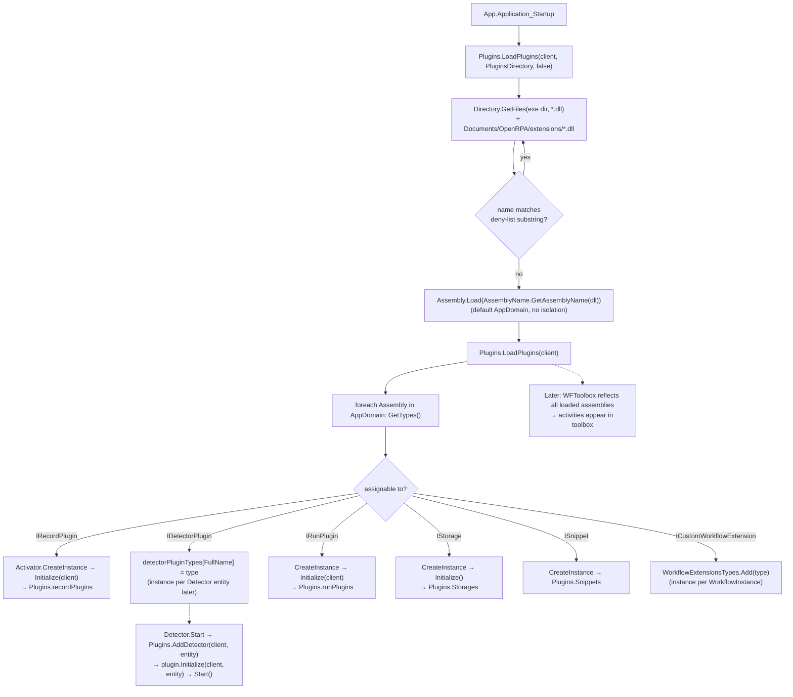

# OpenRPA — Plugin System and Package Management

All paths relative to `reference/openrpa/` (commit `b78115e`).

## 1. Plugin interfaces

All in project `OpenRPA.Interfaces`.

| Interface | File | Members (Observed) | Purpose |
|---|---|---|---|
| `IPlugin` | `IPlugin.cs` | `Initialize(IOpenRPAClient)`, `UserControl editor`, `string Name` | Base; note it exposes a **WPF `UserControl`** |
| `IRecordPlugin : INotifyPropertyChanged, IPlugin` | `IRecordPlugin.cs` | `Status`, `Start()`, `Stop()`, `Priority`, events `OnUserAction`/`OnMouseMove`, `ParseUserAction(ref IRecordEvent)`, `ParseMouseMoveAction(ref IRecordEvent)`, `GetRootElements(Selector anchor)`, `GetSelector(Selector anchor, treeelement)`, `GetElementsWithSelector(Selector, IElement from, int max)`, `LaunchBySelector(...)`, `CloseBySelector(...)`, `Match(SelectorItem, IElement)` | **Automation provider + recorder + selector engine** in one contract |
| `IDetectorPlugin : INotifyPropertyChanged, IPlugin` | `IDetectorPlugin.cs` | `Initialize(client, IDetector entity)`, `Entity`, event `OnDetector(DetectorDelegate)`, `Start()`, `Stop()` | Event triggers |
| `IRunPlugin : INotifyPropertyChanged, IPlugin` | `IRunPlugin.cs` | `onWorkflowStarting(ref IWorkflowInstance, bool resumed) : bool`, `onWorkflowResumeBookmark(...) : bool`, `onWorkflowCompleted/Aborted/Idle(ref IWorkflowInstance)` | Lifecycle hooks with veto |
| `IStorage : IDisposable` | `IStorage.cs` | `Name`, `Initialize()`, `FindAll<T>`, `FindById<T>`, `Insert<T>`, `Update<T>`, `Delete<T>` (`T : apibase`) | Local persistence backends |
| `ISnippet` | `ISnippet.cs` | `Name`, `Category`, `Xaml`, `Snippet` | Reusable XAML fragments |
| `ICustomWorkflowExtension` | `ICustomWorkflowExtension.cs` | `Initialize(IOpenRPAClient, IWorkflow, IWorkflowInstance)` | Per-instance WF4 extension |
| `IOpenRPAClient` | `IOpenRPAClient.cs` | events `Status/Signedin/Connected/Disconnected/ReadyForAction`, `WorkItemQueues`, `Window`, `CurrentDesigner`, `Designers`, `GetWorkflow*`, `WorkflowInstances`, `ParseCommandLineArgs` | Host API handed to plugins (implemented by `RobotInstance`) |

Implementations found (Observed via `grep`):

| Kind | Implementations |
|---|---|
| `IRecordPlugin` | `OpenRPA.Windows.Plugin` ("Windows", Priority 10), `OpenRPA.NM.Plugin`, `OpenRPA.IE.Plugin`, `OpenRPA.Java.Plugin`, `OpenRPA.SAP.Plugin`, `OpenRPA.Image.Plugin`, `OpenRPA.Office.Plugin` ("Office"), `OpenRPA.Script.Plugin` |
| `IDetectorPlugin` | `WindowsClickDetectorPlugin`, `WindowsElementDetectorPlugin`, `KeyboardDetectorPlugin`, `URLDetectorPlugin`, `DownloadDetectorPlugin`, `FileWatcherDetectorPlugin`, `MSSpeechPlugin`, `JavaClickDetectorPlugin` |
| `IRunPlugin` | `OpenRPA.AviRecorder.RunPlugin`, `OpenRPA.PDPlugin.PDPlugin`, `OpenRPA.RDServicePlugin.Plugin`, `OpenRPA.TerminalEmulator.RunPlugin` |
| `IStorage` | `OpenRPA.Storage.LiteDB.Instance`, `OpenRPA.Storage.Filesystem.Instance` |
| `ICustomWorkflowExtension` | `OpenRPA.Windows.WindowsCacheExtension` |
| `IPlugin` only | `OpenRPA.OpenFlowDB.Plugin` |

Observed: `OpenRPA.Office.Plugin` implements `IRecordPlugin` but returns empty results for selector
operations (`GetElementsWithSelector` → `new IElement[] { }`) — it exists mainly so the assembly is recognised.

## 2. Discovery and loading

**Class:** `OpenRPA.Interfaces.Plugins` (static) · **File:** `OpenRPA.Interfaces/Plugins.cs`

Observed steps:
1. `LoadPlugins(client, projectsDirectory = Extensions.PluginsDirectory, recursive: false)` (line 272) is
   called once from `App.Application_Startup` (`App.xaml.cs:260`).
2. Enumerate `*.dll` in the exe folder plus `Documents\OpenRPA\extensions\*.dll` (NuGet-installed project dependencies).
3. Skip by **substring deny-list** (`DotNetProjects.`, `Emgu.`, `NuGet.`, `System.*.`, `libcef.dll`, `MailKit.dll`, ...; lines 301-345).
4. `Assembly.Load(AssemblyName.GetAssemblyName(dllFile))` — every remaining DLL is loaded into the **single default AppDomain**;
   `BadImageFormatException` ignored.
5. `LoadPlugins(client)` (line 68): `AppDomain.CurrentDomain.GetAssemblies()` → `GetTypes()` on all → collect types assignable to each interface.
6. Instantiate via `Activator.CreateInstance(type)` (parameterless ctor), de-duplicated by type:
   - `IRecordPlugin` → `plugin.Initialize(client)` → added to `Plugins.recordPlugins` on UI thread.
   - `IDetectorPlugin` → only the **type** is stored in `detectorPluginTypes[FullName]`; instances are created per
     `Detector` entity by `Plugins.AddDetector(client, entity)` (line 21) when a detector is started.
   - `ISnippet` → `Snippets`; `IStorage` → `Initialize()` → `Storages`; `IRunPlugin` → `Initialize(client)` → `runPlugins`.
   - `ICustomWorkflowExtension` → type stored in `WorkflowExtensionsTypes`; instantiated **per workflow instance** in `WorkflowInstance.createApp`.
7. Assembly resolution fallback: `App.LoadFromSameFolder` (`App.xaml.cs:135`) probes exe dir, `PluginsDirectory`,
   `ProjectsDirectory\extensions`, and **`%TEMP%`**.

### Diagram 4 — Plugin loading



## 3. Plugin lifecycle (Observed)

```text
Discover (file scan) → Load (Assembly.Load) → Reflect → Create (Activator) → Initialize(IOpenRPAClient)
  → [Record]   Start()/Stop() around recording sessions (MainWindow.StartRecordPlugins)
  → [Detector] Start()/Stop() per Detector entity; UpdateDetector = Stop, swap Entity, Start
  → [Run]      called on every instance create/resume/complete/abort/idle
  → [Storage]  used for all entity I/O
Dispose: none — no unload, no Dispose call on plugins (IStorage : IDisposable but not observed being disposed).
```

## 4. How plugins register activities

Not via an API. Activities are public WF4 types in the plugin assembly; once the assembly is loaded
into the AppDomain, `WFToolbox.InitializeActivitiesToolbox()` finds them by reflection
(see [openrpa-activities.md](openrpa-activities.md) §5). Recorder plugins additionally **construct**
their own activities (`new GetElement { Selector = ... }`) and hand them back via `IRecordEvent.a : IBodyActivity`.

## 5. How plugins communicate with the core

- **Inbound (core → plugin)**: direct method calls on interfaces; `IOpenRPAClient` passed at `Initialize`.
- **Outbound (plugin → core)**: .NET events (`OnUserAction`, `OnMouseMove`, `OnDetector`), plus direct use of
  static globals: `global.OpenRPAClient`, `global.webSocketClient`, `Config.local`, `Plugins.*`,
  `GenericTools.RunUI`, `Log`. Example: `OpenRPA.NM.Plugin.ParseUserAction` calls
  `global.OpenRPAClient.CurrentDesigner.GetVariableOf<DataTable>("dt")` to create a designer variable.
- **Cross-plugin**: the host orchestrates by name (`Plugins.recordPlugins.Where(x => x.Name == "Windows")`), and
  the Windows recorder's event is offered to other recorders via `ParseUserAction` in `Priority` order.
- **Out-of-process**: SAP and Java plugins talk to bridge executables over `OpenRPA.NamedPipeWrapper`; the browser plugin
  talks to `OpenRPA.NativeMessagingHost.exe` over named pipes.

## 6. Dependency handling

- All plugin dependencies must be binary-compatible in one AppDomain (no `AssemblyLoadContext` isolation on .NET Framework).
- Version conflicts are handled by: build-time co-location in the same output folder, binding redirects in `OpenRPA.exe.config`
  (packed as NuGet `build` content), and the `AssemblyResolve` probe list.
- The deny-list in `Plugins.LoadPlugins` exists to avoid loading native or conflicting assemblies as plugins.

## 7. Package / dependency management (NuGet)

- `IProject.dependencies : Dictionary<string, string>` (package id → version range) (`OpenRPA.Interfaces/IProject.cs`).
- `Project.InstallDependencies(bool LoadDlls)` (`OpenRPA/Project.cs:507`) → `NuGetPackageManager.Instance.DownloadAndInstall(project, PackageIdentity, LoadDlls)`
  (`OpenRPA/NuGet/NuGetPackageManager.cs:366`).
- Uses NuGet client libraries 5.11 with target framework `net462` (`NuGetFramework.ParseFolder("net462")`, line 34),
  resolves via `FrameworkReducer`, and extracts DLLs into the **shared** `Documents\OpenRPA\extensions` folder
  (line 415) — not per project. Package sources come from standard NuGet settings; repository ordering prefers
  local, then `nuget.org`, then "official" (lines 312-324).
- `Config.local.restore_dependencies_on_startup` wipes `extensions` at startup (`App.xaml.cs:238`).
- OpenRPA's own plugins are published as NuGet packages (`GeneratePackageOnBuild`, `ReleaseNuget` → `nuget.exe push`).
- Deployment of the product itself: WiX MSI and NSIS installers; `CheckForUpdatesAsync` in `RobotInstance`.

## MyRPA implication

- **Retain**: the *categories* of extension points (provider/recorder, trigger/detector, run-lifecycle hook,
  storage, snippet/template, per-run extension) — they map well onto PRD Phase 3 categories.
- **Retain**: plugin receives a host API object at initialization.
- **Redesign**:
  - Discovery by explicit manifest (id, version, entry type, capabilities, required host API version),
    not "load every DLL and reflect everything".
  - Isolation via `AssemblyLoadContext` per plugin (collectible where possible) or out-of-process for hostile SDKs.
  - Split `IRecordPlugin` into separate capabilities: automation provider, selector engine, recorder, element picker UI.
  - No UI types (`UserControl`) in core plugin contracts; UI contributions belong to a Studio-only contract.
  - DI-based host services instead of static globals; plugin disposal/unload.
  - Per-project package resolution with lock files, signature/hash validation, and no shared mutable `extensions` folder.
