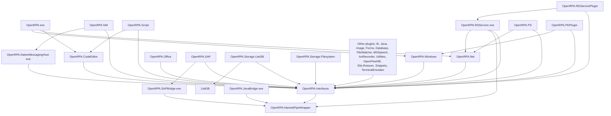

# OpenRPA — Solution Structure and Projects

Source: `reference/openrpa/OpenRPA.sln` and every `*.csproj` (commit `b78115e`).

## Target frameworks and build

Observed:
- All projects are SDK-style csproj but target **.NET Framework**: `net462` (most), `net46`
  (`OpenRPA.Interfaces`, `OpenRPA.Net`, `OpenRPA.WorkItems.Activities`), `net45` (`OpenRPA.SAPBridge`),
  `net40` (`OpenRPA.JavaBridge`, `OpenRPA.NamedPipeWrapper`).
- They reference `System.Activities`, `System.Activities.Presentation`, `System.Runtime.Remoting`,
  WPF (`PresentationCore`, `WindowsBase`, `System.Xaml`) — none of these exist on modern .NET
  (WF4 and .NET Remoting were never ported to .NET Core/.NET 5+).
- Plugin projects build into the **same output folder** as the exe (`..\debug`, `..\debug86`, `..\dist`),
  which is how they end up in `Extensions.PluginsDirectory` (= exe folder,
  `OpenRPA.Interfaces/Extensions.cs:352`).
- Configurations: `Debug; Release; ReleaseNuget; PrepInstaller`. `ReleaseNuget` pushes packages to
  nuget.org (`OpenRPA.Interfaces.csproj` `PushNugetPackage` target). Installer: WiX (`OpenRPA.SetupProject`,
  `OpenRPA.wxs`) and NSIS (`openrpa.nsi`).
- No test projects exist.

## Projects

| Project | Type | TFM | Responsibility |
|---|---|---|---|
| `OpenRPA` | WinExe (WPF) | net462 | Host app: UI, designer, runtime hosting, robot, OpenFlow sync, NuGet, OTel |
| `OpenRPA.Interfaces` | Library (NuGet `OpenRPA.Interfaces`) | net46 | Plugin contracts **plus** shared implementation: `UIElement`, selectors, input driver, config, log, IPC service, overlays, entities |
| `OpenRPA.Net` | Library | net46 | OpenFlow WebSocket client + message DTOs |
| `OpenRPA.NamedPipeWrapper` | Library | net40 | Typed named-pipe client/server (JSON frames) |
| `OpenRPA.Windows` | Plugin | net462 | UIA provider: recorder, selectors, detectors, `GetElement`/`GetWindows`/`CloseWindow` |
| `OpenRPA.NM` | Plugin | net462 | Browser provider via native messaging: `NMHook`, selectors, `GetElement`/`OpenURL`/`ExecuteScript`/`GetTable`/... |
| `OpenRPA.NativeMessagingHost` | Exe | net462 | Chrome/Firefox/Edge native messaging host; bridges stdio ↔ named pipe; embeds extension JS |
| `OpenRPA.Office` | Plugin | net462 | Excel/Word/Outlook/PowerPoint via COM Interop |
| `OpenRPA.IE` | Plugin | net462 | Internet Explorer automation (HtmlAgilityPack) |
| `OpenRPA.Java` / `OpenRPA.JavaBridge` | Plugin / Exe | net462 / net40 | Java Access Bridge automation (out-of-process bridge) |
| `OpenRPA.SAP` / `OpenRPA.SAPBridge` | Plugin / Exe | net462 / net45 | SAP GUI scripting (out-of-process bridge over named pipes) |
| `OpenRPA.Image` | Plugin | net462 | Image matching/OCR (Emgu.CV) |
| `OpenRPA.Script` | Plugin | net462 | `InvokeCode` (VB, C#, PowerShell, Python, AutoHotkey), `PipInstall` |
| `OpenRPA.CodeEditor` | Library | net462 | Roslyn-backed code editor (AvalonEdit) |
| `OpenRPA.Utilities` | Plugin | net462 | Excel/PDF/data helpers (ClosedXML, ExcelDataReader, iTextSharp) |
| `OpenRPA.Forms` | Plugin | net462 | Forge.Forms dialogs, toast notifications |
| `OpenRPA.Database` | Plugin | net462 | DB activities |
| `OpenRPA.FileWatcher` | Plugin | net462 | File-watcher detector |
| `OpenRPA.MSSpeech` | Plugin | net462 | Speech detector |
| `OpenRPA.AviRecorder` | Plugin | net462 | Screen recording as `IRunPlugin` |
| `OpenRPA.PDPlugin` | Plugin | net462 | `IRunPlugin` (process discovery; not read in depth) |
| `OpenRPA.TerminalEmulator` (+ `Open3270`, `vb5250/*`) | Plugin | net462 | 3270/5250 terminal automation |
| `OpenRPA.OpenFlowDB` | Plugin | net462 | OpenFlow DB activities |
| `OpenRPA.Elis.Rossum` | Plugin | net462 | Rossum document AI integration |
| `OpenRPA.WorkItems.Activities` | Library | net46 | Standalone work-item activities package (references FlaUI from `lib/`) |
| `OpenRPA.Storage.LiteDB` | Plugin (`IStorage`) | net462 | Local store in `<wsurl host>.db` / `offline.db` |
| `OpenRPA.Storage.Filesystem` | Plugin (`IStorage`) | net462 | Local store as JSON files per entity type |
| `LiteDB` | Library (vendored source) | — | Embedded document DB |
| `OpenRPA.RDService` / `RDServiceMonitor` / `RDServicePlugin` | Exe / Exe / Plugin | net462 | Windows service that keeps robot user sessions logged in via RDP (FreeRDP) |
| `OpenRPA.PS` | Library | net462 | PowerShell module for OpenRPA/OpenFlow |
| `OpenRPA.Snippets` | Library | net462 | Snippet provider |
| `OpenRPA.SetupActions` / `OpenRPA.SetupProject` | Installer | — | WiX custom actions / setup |
| `PatchVSCode` | Exe | net48 | Tooling |

## Project dependency graph (ProjectReference only)

Observed: the host `OpenRPA` only has compile-time references to `CodeEditor`, `Net`, and `Windows`.
All other plugins are **runtime-discovered** (see [openrpa-plugins.md](openrpa-plugins.md)), yet the host
code does refer to specific plugins by name at runtime (e.g. `Plugins.recordPlugins.Where(x => x.Name == "Windows").First()`
in `MainWindow.StartRecordPlugins`, and reflection on `"OpenRPA.Script"` / `"ScriptActivities"` in
`WFToolbox.InitializeActivitiesToolbox`).

Analysis: `OpenRPA.Interfaces` is the de-facto SDK, but it is not a thin contract assembly — it
carries FlaUI, NLog, WPF, `System.Activities.Presentation`, Remoting, registry, and DPAPI dependencies.
Every plugin therefore inherits the full desktop stack.

## Major NuGet dependencies

| Package | Version | Used by | Purpose |
|---|---|---|---|
| `FlaUI.UIA3` | 3.2.0 | Interfaces | UI Automation (COM UIA3) wrapper |
| `NLog` | 4.7.13 | Interfaces | File logging |
| `Newtonsoft.Json` | 13.0.2 | NamedPipeWrapper, Storage.* | All JSON |
| `OpenTelemetry.Exporter.OpenTelemetryProtocol` | 1.11.1 | OpenRPA | OTLP traces/metrics/logs |
| `NuGet.Common/Packaging/Protocol/Resolver` | 5.11.x | OpenRPA | Project dependency install |
| `DotNetProjects.Wpf.Toolkit`, `Extended.Wpf.Toolkit` | 5.0.43 / 4.2.0 | OpenRPA | WPF controls/docking |
| `AvalonEdit`, `Microsoft.CodeAnalysis.*.Features` | 6.1.3.50 / 4.0.1 | CodeEditor, Script, NM | Code editing with Roslyn |
| `Python.Included`, `sharpAHK`, `System.Management.Automation.dll` | — | Script | Python/AHK/PowerShell execution |
| `Emgu.CV` | 4.1.1.3497 | Image | Computer vision |
| `HtmlAgilityPack` | 1.11.40 | IE | HTML parsing |
| `ClosedXML`, `ExcelDataReader.DataSet`, `iTextSharp` | — | Utilities | Excel/PDF |
| `FreeRDP-Sharp`, `SimpleImpersonation` | — | RDService | RDP session control |
| `Forge.Forms`, `ToastNotifications` | — | Forms | UI dialogs |
| Office Interop DLLs (`lib/`) | — | Office | COM Interop (Excel, Outlook, PowerPoint, Word) |

## Entry points

| Executable | Entry | File |
|---|---|---|
| `OpenRPA.exe` | `App.Main()` `[STAThread]` (single-instance via `SingleInstance<App>`) | `OpenRPA/App.xaml.cs:23` |
| `OpenRPA.NativeMessagingHost.exe` | `Program.Main()` | `OpenRPA.NativeMessagingHost/Program.cs` |
| `OpenRPA.RDService.exe` | `Program.Main()` (Windows service / console) | `OpenRPA.RDService/Program.cs:79` |
| `OpenRPA.SAPBridge.exe`, `OpenRPA.JavaBridge.exe` | bridge processes over named pipes | respective projects |

Command-line: `App.Main` honours `-workingdir`; `RobotInstance.ParseCommandLineArgs` honours
`-workflowid` (forwarded via `OpenRPAServiceUtil.RemoteInstance.RunWorkflowByIDOrRelativeFilename`,
`OpenRPA/RobotInstance.cs:982`). A second `OpenRPA.exe` launch forwards its args to the first instance
through `SignalExternalCommandLineArgs` (`App.xaml.cs:194`).

## MyRPA implication

- None of the OpenRPA binaries can be reused on .NET 10: WF4 (`System.Activities`) and .NET Remoting
  are .NET Framework-only. (Community port "CoreWF" exists but is not used by OpenRPA — Not evaluated
  in this phase.)
- The project split by **technology** (Windows / NM / Office / SAP / Java) is sound and worth
  mirroring; the split of **contracts vs. implementation** (`OpenRPA.Interfaces`) is not.
- Out-of-process bridges (SAPBridge, JavaBridge, NativeMessagingHost) show the need for a
  process-boundary story for providers whose SDKs demand bitness/runtime isolation.
