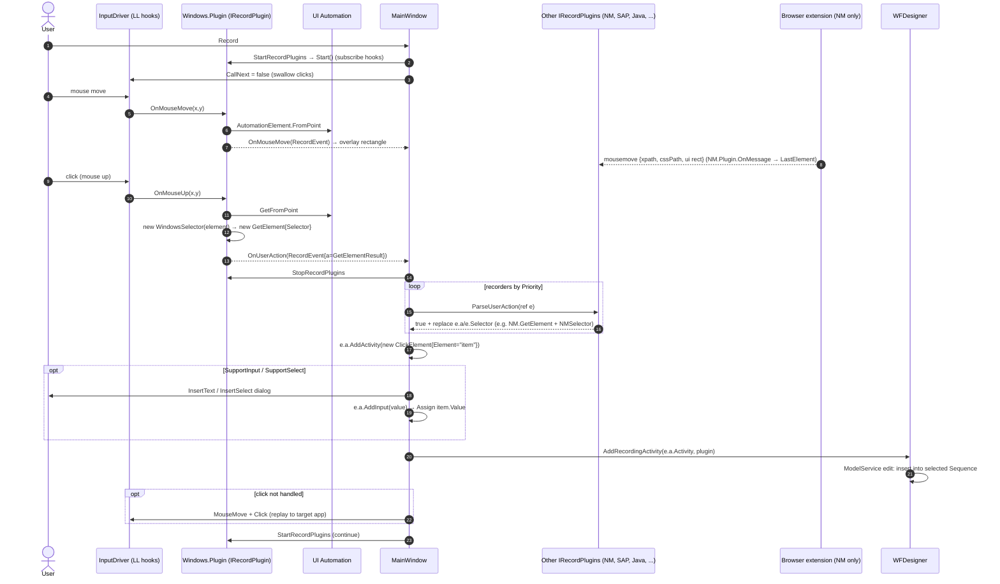

# OpenRPA — Recording

All paths relative to `reference/openrpa/` (commit `b78115e`).

## 1. Components

| Component | Project | Class / Member | File | Responsibility |
|---|---|---|---|---|
| Global input hooks | OpenRPA.Interfaces | `InputDriver` (sealed partial, singleton `Instance`) | `OpenRPA.Interfaces/Input/InputDriver.cs:34` | Installs `WH_KEYBOARD_LL` / `WH_MOUSE_LL` via `SetWindowsHookEx` (line 355-358); raises `OnMouseDown/Up/Move`, `OnKeyDown/Up`; `CallNext` controls whether input is passed through |
| Recording controller | OpenRPA | `MainWindow.OnRecord`, `StartRecordPlugins`, `StopRecordPlugins`, `OnUserAction`, `OnMouseMove` | `OpenRPA/MainWindow.xaml.cs:3151-3413` | Starts recorders, receives events, asks other recorders to claim the event, builds activities, inserts into designer |
| Base recorder (Windows) | OpenRPA.Windows | `Plugin : IRecordPlugin` | `OpenRPA.Windows/Plugin.cs` | Hit-tests with UIA, builds `WindowsSelector`, creates `GetElement` activity |
| Browser recorder | OpenRPA.NM | `Plugin.ParseUserAction`, `Plugin.OnMessage` | `OpenRPA.NM/Plugin.cs:170, 296` | Claims clicks inside chrome/msedge/firefox; uses last element reported by the extension |
| Other recorders | OpenRPA.SAP, .Java, .IE, .Image | `Plugin : IRecordPlugin` | — | Claim events for their technology (not read in depth) |
| Record event | OpenRPA.Interfaces | `IRecordEvent` (impl. `RecordEvent` per plugin) | `OpenRPA.Interfaces/IRecordEvent.cs` | `UIElement`, `Element`, `Process`, `Selector`, `a : IBodyActivity`, `SupportInput`, `SupportSelect`, `Button`, `ClickHandled`, `SupportVirtualClick`, `X/Y`, `OffsetX/Y` |
| Activity builder | OpenRPA.Interfaces | `IBodyActivity` (`Activity`, `AddActivity(a, name)`, `AddInput(value, element)`) | `OpenRPA.Interfaces/IBodyActivity.cs` | Wraps a finder activity so the host can put a child action (click / assign value) into its body |
| Designer insertion | OpenRPA | `WFDesigner.AddRecordingActivity`, `EndRecording`, `AddActivity` | `OpenRPA/Views/WFDesigner.xaml.cs:764-830` | Inserts ModelItems into the selected `Sequence`/`Flowchart` |
| Overlay | OpenRPA.Interfaces | `Overlay.OverlayWindow` | `OpenRPA.Interfaces/Overlay/OverlayWindow.cs` | Green rectangle following the hovered element |
| Input dialogs | OpenRPA | `Views.InsertText`, `Views.InsertSelect` | `OpenRPA/Views/*.xaml.cs` | Ask user what text to type / which option to select |

## 2. Observed flow

1. `MainWindow.OnRecord` (`MainWindow.xaml.cs:3391`): designer `ReadOnly = true`, stop detectors,
   subscribe `InputDriver.OnKeyDown/OnKeyUp`, `StartRecordPlugins(true)`, `InputDriver.CallNext = false`
   (**the user's physical click is swallowed**), minimize window.
2. `StartRecordPlugins` subscribes `OnUserAction`/`OnMouseMove` on the **"Windows"** recorder (required) and
   **"SAP"** (if present), and calls `Start()` → `InputDriver.Instance.OnMouseUp/Down/Move += ...`
   (`OpenRPA.Windows/Plugin.cs:110`). Other recorders (NM, Java, IE, ...) are not started here; they
   participate by claiming events in step 5.
3. Mouse move (`Windows.Plugin._OnMouseMove`, line 136): background thread →
   `System.Windows.Automation.AutomationElement.FromPoint(x,y)` → `RecordEvent` → `OnMouseMove` →
   `MainWindow.OnMouseMove` lets other recorders `ParseMouseMoveAction` and moves the overlay to `e.Element.Rectangle`.
4. Mouse up (`Windows.Plugin.OnMouseUp`, line 199): background thread →
   `AutomationHelper.GetFromPoint(x,y)` → `new WindowsSelector(element.RawElement, null, PluginConfig.enum_selector_properties)`
   → `new GetElement { Selector = sel.ToString(), MaxResults = 1, Image = element.ImageString() }` with `Index`/`Total` variables
   → `re.a = new GetElementResult(a)`, `SupportInput` (ControlType Edit/Document), `SupportSelect` (ComboBox), process
   → `OnUserAction(this, re)`.
5. `MainWindow.OnUserAction` (`MainWindow.xaml.cs:3266`): stops Windows recorder; on UI thread, for each other
   recorder by `Priority`, `p.ParseUserAction(ref e)`; first to return `true` "owns" the event and may replace
   `e.a`, `e.Selector`, `e.Element` (e.g. NM plugin replaces with `NM.GetElement` + `NMSelector`, or `GetTable`
   for HTML tables).
6. Host adds the **action** into the finder's body: `e.a.AddActivity(new ClickElement { Element = VisualBasicValue<IElement>("item"), OffsetX, OffsetY, Button, VirtualClick, AnimateMouse }, "item")`.
   - If `SupportSelect`: show `InsertSelect`; `e.a.AddInput(selectedValue, element)`.
   - Else if `SupportInput`: show `InsertText`; `e.a.AddInput(text, element)` → `Assign<string>{ To = item.Value (or item.SendKeys), Value = text }`
     (`OpenRPA.Windows/Plugin.cs:527`).
7. `WFDesigner.AddRecordingActivity(e.a.Activity, plugin)` → adds VB namespace imports and assembly reference of the plugin,
   then `AddActivity(a)` into the selected sequence (or buffers until `EndRecording` when `recording_add_to_designer` is false).
8. If the click was not handled by an activity (`ClickHandled == false && !SupportInput`), the host **replays** the click:
   `InputDriver.MouseMove(e.X, e.Y); InputDriver.Click(e.Button)`, so the target app still receives it.
9. Restart Windows recorder; repeat. Keyboard `Escape`/cancel key ends recording (handled in `OnKeyUp`; not traced in detail).

### Diagram 5 — Recording



## 3. Generated shape (Observed)

```text
GetElement (Windows | NM)   Selector = <JSON selector>, MaxResults = 1, Image = <base64 screenshot>
  Variables: Index, Total
  Body: ActivityAction<UIElement|NMElement>(item)
      └── ClickElement { Element = item, OffsetX, OffsetY, Button, VirtualClick }
          or Assign<string> { To = item.Value, Value = "<typed text>" }
```

## MyRPA implication

- **Retain**: the "base recorder hit-tests; technology-specific recorders may claim the event by priority"
  chain-of-responsibility is a good way to combine desktop + browser + SAP recording.
- **Retain**: recorder emits a *finder + action* pair and a screenshot of the target for later review.
- **Redesign**: recording is hard-wired into `MainWindow` (WPF) and requires the Windows recorder by name.
  MyRPA should put the recording session in a UI-independent service that emits a stream of
  *recorded steps* (typed DTOs), with Studio subscribing and converting them to workflow nodes.
- **Redesign**: for browser recording in MyRPA (PRD Phase 6), Playwright-based recording in the page
  context should replace screen-coordinate hit-testing; coordinate replays should be a last resort
  (PRD 6.5).
- **Avoid**: swallowing the user's click and re-injecting it (`CallNext = false` + replay) — fragile with
  focus changes and timing; prefer passive observation in the target (DOM events) where possible.
