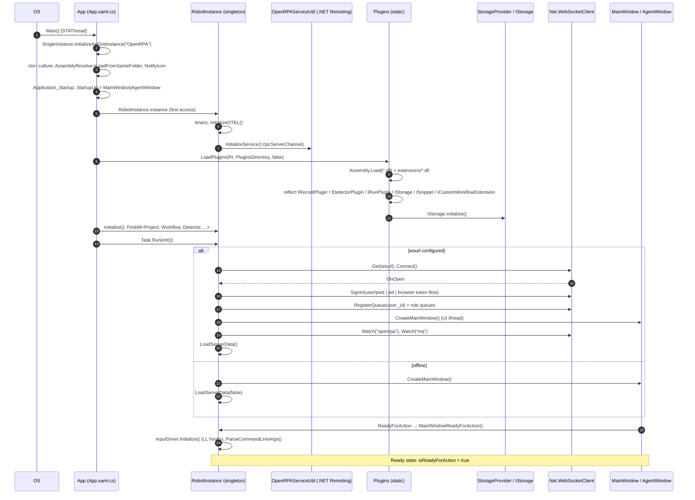
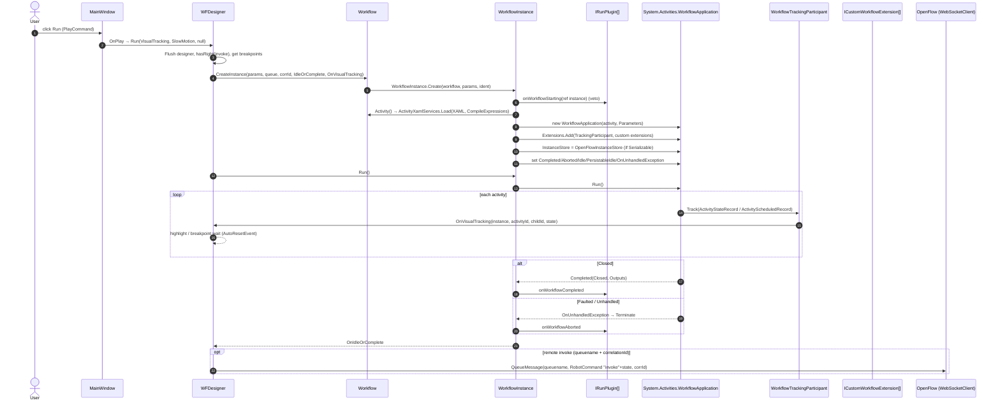

# OpenRPA — Application Startup and Workflow Runtime

All paths relative to `reference/openrpa/` (commit `b78115e`).

---

## 1. Application startup

### Observed sequence

| Stage | Class / Method | File | What happens |
|---|---|---|---|
| Process entry | `App.Main()` | `OpenRPA/App.xaml.cs:23` | `SingleInstance<App>.InitializeAsFirstInstance("OpenRPA")`; hooks `AppDomain.UnhandledException`; parses `-workingdir` → `Log.ResetLogPath`; `new App().Run()` |
| App ctor | `App()` | `App.xaml.cs:75` | Applies `Config.local.culture` to threads; registers `AssemblyResolve += LoadFromSameFolder` (probes exe dir, `PluginsDirectory`, `ProjectsDirectory\extensions`, `%TEMP%`); creates tray `NotifyIcon` |
| Startup event | `App.Application_Startup` | `App.xaml.cs:200` | Captures `AutomationHelper.syncContext` (UI thread); chooses `MainWindow.xaml` or `AgentWindow.xaml` by `Config.local.isagent`; deletes `files_pending_deletion`; optionally wipes `extensions` folder |
| Singleton + IPC | `RobotInstance.instance` getter | `OpenRPA/RobotInstance.cs:99` | Creates `RobotInstance` (timers, `InitializeOTEL()`), sets `global.OpenRPAClient`, starts `.NET Remoting` IPC server `OpenRPAServiceUtil.InitializeService()` |
| Input | `InputDriver.Instance.initCancelKey(Config.local.cancelkey)` | `App.xaml.cs:259` | Registers global cancel key |
| **Plugin loading** | `Plugins.LoadPlugins(RobotInstance.instance, Extensions.PluginsDirectory, false)` | `OpenRPA.Interfaces/Plugins.cs:272` | `Assembly.Load` every `*.dll` in exe folder + `extensions`, then reflection scan and `Initialize(client)` (see [openrpa-plugins.md](openrpa-plugins.md)) |
| Local data | `RobotInstance.Initialize()` | `RobotInstance.cs:86` | `StorageProvider.FindAll<Project/WorkitemQueue/Detector/Workflow/Workitem>()` into observable collections |
| Service init | `await RobotInstance.instance.init()` (background `Task.Run`) | `RobotInstance.cs:1005` | `Config.Save()`, `CheckForUpdatesAsync()`; if `Config.local.wsurl` set → `Net.WebSocketClient.Get(wsurl)`, wire `OnOpen/OnClose/OnQueueMessage/OnQueueClosed`, `Connect()`; else offline path |
| Offline path | `CreateMainWindow()` + `LoadServerData(false)` | `RobotInstance.cs:1060, 376` | |
| Online path | `RobotInstance_WebSocketClient_OnOpen` | `RobotInstance.cs:1135` | Sign-in (username/password DPAPI, JWT, or browser token flow `/AddTokenRequest` + `/Login?key=`), `InitializeOTEL()`, `RegisterQueues()`, `CreateMainWindow()`, `Watch("openrpa", ...)`, `LoadServerData`, register detector exchanges |
| **UI init** | `CreateMainWindow()` | `RobotInstance.cs:1060` | On UI thread (`syncContext.Send`): binds `Window` (`IMainWindow`), subscribes `ReadyForAction`/`Status`; `CodeEditor.init.Initialize()`; loads and **starts detectors** (`Detector.Start(false)`) |
| **Ready** | `MainWindowReadyForAction()` / `ReadyForAction?.Invoke()` | `RobotInstance.cs:219` | Shows window, raises `ReadyForAction`, `InputDriver.Instance.Initialize()` (installs LL hooks); `ParseCommandLineArgs()` runs `-workflowid`; `isReadyForAction = true` |
| Automation | `AutomationHelper.init()` | `RobotInstance.cs:1043` | UIA helper init |

Default: `Config.wsurl` defaults to `"wss://app.openiap.io/"` (`OpenRPA.Interfaces/Config.cs:18`), so a
fresh install tries to connect to the public OpenIAP cloud unless configured otherwise.

### Diagram 1 — Application startup

---

## 2. Workflow model

| Item | Evidence |
|---|---|
| Project: `OpenRPA` · Class: `Workflow : LocallyCached, IWorkflow` · File: `OpenRPA/Workflow.cs:16` | |
| Responsibility | Holds `Xaml` (string), `Parameters` (`List<workflowparameter>`), `Serializable`, `background`, `culture`, `queue`, `projectid` |
| `Activity()` (`Workflow.cs:535`) | `ActivityXamlServices.Load(new XamlXmlReader(Xaml, {LocalAssembly=typeof(Workflow).Assembly}), {CompileExpressions = true})`, cached in `_activity`; optionally under `culture` on a worker thread |
| `ParseParameters()` (`Workflow.cs:590`) | Reads `DynamicActivityProperty`s from XAML via `WFDesigner.GetParameters`; maps `InArgument/OutArgument/InOutArgument` → `workflowparameterdirection` |
| Interface | `IWorkflow` in `OpenRPA.Interfaces/IWorkflow.cs` |

Observed: the workflow file format *is* WF4 XAML (`ActivityBuilder`), with VB expressions
(`Microsoft.VisualBasic.Activities.VisualBasicValue<T>`), compiled at load.

---

## 3. Workflow execution ("User presses Run")

### Observed call chain

1. `MainWindow.PlayCommand` → `OnPlay(object)` (`OpenRPA/MainWindow.xaml.cs:888, 2650`).
   - From project list: `workflow.CreateInstance(param, null, null, designer.IdleOrComplete, designer.OnVisualTracking, 0)` then `designer.Run(...)` or `instance.Run()`.
   - From open designer: saves if `HasChanged`, then `designer.Run(VisualTracking, SlowMotion, null)`.
2. `WFDesigner.Run(bool VisualTracking, bool SlowMotion, IWorkflowInstance instance)` (`OpenRPA/Views/WFDesigner.xaml.cs:1410`):
   - On UI thread: resumes if at breakpoint; `WorkflowDesigner.Flush()`; **ACL check** `Workflow.hasRight(user, ace_right.invoke)` if connected;
     collects `BreakpointLocations`; creates instance with `OnVisualTracking` only when tracking/breakpoints/single-step are needed; `ReadOnly = true`.
   - Then `instance.Run()`.
3. `Workflow.CreateInstance(...)` (`Workflow.cs:569`) → `WorkflowInstance.Create(this, Parameters, ident)`; sets `queuename`, `correlationId`; wires `OnIdleOrComplete`, `OnVisualTracking`.
4. `WorkflowInstance.Create` (`OpenRPA/WorkflowInstance.cs:171`):
   - increments OTel counter `openrpa_workflow_run_count`;
   - **run-plugin veto**: `foreach IRunPlugin: if (!runner.onWorkflowStarting(ref _ref, false)) throw`;
   - stamps `owner/ownerid/host/fqdn`; adds to static `WorkflowInstance.Instances` under `Monitor.TryEnter`;
   - `createApp(Workflow.Activity())`.
5. `createApp(Activity)` (`WorkflowInstance.cs:226`):
   - drops unknown/out parameters; coerces `Int32`/`Boolean` from strings;
   - `wfApp = new System.Activities.WorkflowApplication(activity, Parameters)`;
   - `wfApp.Extensions.Add(TrackingParticipant)` and one instance of every `Plugins.WorkflowExtensionsTypes` (`ICustomWorkflowExtension.Initialize(RobotInstance.instance, Workflow, this)`);
   - if `Workflow.Serializable && !Config.local.disable_instance_store` → `wfApp.InstanceStore = new Store.OpenFlowInstanceStore()`;
   - `addwfApphandlers(wfApp)`; if resuming (`InstanceId` set) → `wfApp.Load(new Guid(InstanceId))`.
6. `WorkflowInstance.Run()` (`WorkflowInstance.cs:730`): starts `runWatch`, `wfApp.Run()`, `InstanceId = wfApp.Id`, `state = "running"`.
   On exception → `state="failed"`, `NotifyAborted()`, `OnIdleOrComplete`.
7. WF4 runtime executes activities on its own scheduler thread (see [openrpa-activities.md](openrpa-activities.md)).
8. Completion handlers (`addwfApphandlers`, `WorkflowInstance.cs:799`):
   - `Completed`: `Faulted` → `state="aborted"`, `errormessage = TerminationException.Message`; `Closed` → `state="completed"`, copies `e.Outputs` into `Parameters`, `NotifyCompleted()`.
   - `Aborted`: `state="aborted"`, `Exception = e.Reason`.
   - `Idle`: records bookmark names into `Bookmarks`, `state="idle"`, `NotifyIdle()`.
   - `PersistableIdle`: returns `PersistableIdleAction.Persist`.
   - `OnUnhandledException`: unwraps `TargetInvocationException`, sets `errorsource = e.ExceptionSource.Id`, `state="failed"`, returns `UnhandledExceptionAction.Terminate`.
   - All paths raise `OnIdleOrComplete` → `WFDesigner.IdleOrComplete` / `MainWindow.IdleOrComplete`, which (when `queuename`+`correlationId` are set) replies to OpenFlow with `RobotCommand{command = "invoke" + state}` (`WFDesigner.xaml.cs:1235-1251`).
9. `RobotInstance.unsavedTimer` (5 s) saves dirty instances via `Save<WorkflowInstance>()` and calls `WorkflowInstance.CleanUp()` (`RobotInstance.cs:240`).

### Instance states (Observed string literals)

`loaded` → `running` → (`idle` ↔ `running`) → `completed` | `failed` | `aborted`; also `unloaded`.
Remote replies use `invokecompleted`, `invokefailed`, `invokeaborted`, `invokeidle` (derived as `"invoke" + state`).

### Diagram 2 — Workflow execution

---

## 4. Tracking, debugging, and telemetry

- `WorkflowTrackingParticipant : System.Activities.Tracking.TrackingParticipant` (`OpenRPA/WorkflowTrackingParticipant.cs:17`)
  subscribes to all workflow-instance, activity-state (`Arguments = *`, `Variables = {"item"}`), and
  activity-scheduled records.
  - Starts an OpenTelemetry `System.Diagnostics.Activity` span per workflow (parented on `TraceId/SpanId`
    passed from OpenFlow) and per activity; records durations to `RobotInstance.meter_activities`.
  - Raises `OnVisualTracking` → `WFDesigner.OnVisualTracking` (`WFDesigner.xaml.cs:1167`) which maps
    activity IDs to `SourceLocation`, highlights the designer, sleeps 500 ms in slow-motion, and **blocks the
    workflow thread** on `ResumeRuntimeFromHost.WaitOne()` at breakpoints/single-step.
- `Tracing : TraceListener` (`OpenRPA/Tracing.cs:85`) receives all `System.Diagnostics.Trace` output, tags
  it with the current `Tracing.InstanceId` (`ThreadLocal<string>`), appends to the instance console and
  the OTel logger (`RobotInstance.LocalLogProvider`).
- `RobotInstance.InitializeOTEL()` (`RobotInstance.cs:1972`) configures OTLP trace/metric/log exporters
  and performance counters (CPU, working set).

## 5. Persistence

- WF4 durable instances: `OpenRPA/Store/OpenFlowInstanceStore.cs` (`CustomInstanceStoreBase`) stores the
  serialized instance document Base64-encoded in `WorkflowInstance.xml` and saves the instance entity
  locally (`Save<WorkflowInstance>(true)` = skip online).
- `WorkflowInstance.RunPendingInstances()` (`WorkflowInstance.cs:941`) — the resume-after-restart logic is
  **commented out** ("TODO: Re-implement RunPendingInstances"). Observed: resumption of persisted
  instances after a process restart is not active in this commit.
- Entities (`Project`, `Workflow`, `Detector`, `WorkitemQueue`, `Workitem`, `WorkflowInstance`) derive
  from `LocallyCached : apibase` (`OpenRPA/LocallyCached.cs`) whose `Save<T>()` writes through
  `StorageProvider` (all `Plugins.Storages`) and, when connected, to OpenFlow collections
  `openrpa`, `openrpa_instances`, `mq`, `workitems` (`InsertOne`/`UpdateOne`).
- `StorageProvider` (`OpenRPA/StorageProvider.cs`) is a static fan-out: reads return the first storage
  with results; writes go to **every** registered `IStorage`.
  - `OpenRPA.Storage.LiteDB.Instance`: `Documents\OpenRPA\<wsurl-host>.db` or `offline.db`.
  - `OpenRPA.Storage.Filesystem.Instance`: `...\<host|offline>\{workflows,projects,detectors,workitemqueues,workitems,openrpa_instances}\<id>.json`.

## 6. Error handling

Observed:
- Exception types: `ElementNotFoundException`, `BusinessRuleException`, `LockNotReceivedException`,
  `SocketException` (`OpenRPA.Interfaces/Exceptions.cs`).
- Activities throw; WF4 routes to `TryCatch` in the workflow or to `wfApp.OnUnhandledException`, which
  **always terminates** the instance (`UnhandledExceptionAction.Terminate`).
- Errors are captured as strings on the instance (`errormessage`, `errorsource` = activity Id) and in
  `Exception` (not serializable to OpenFlow as-is; replies use `JObject.FromObject(instance.Exception)`).
- Pervasive `try { ... } catch (Exception ex) { Log.Error(ex.ToString()); }` swallowing throughout host
  code; lock timeouts may call `System.Environment.Exit(1)` when `Config.local.thread_exit_on_lock_timeout`.
- `ThrowBusinessRuleException` activity exists for work-item business failures.

## 7. Configuration

- `Config` (`OpenRPA.Interfaces/Config.cs`), static `Config.local`, backed by `settings.json` located in
  `%APPDATA%\OpenRPA`, `Documents\OpenRPA`, or the parent dir of the exe (`Config.cs:132-158`).
- Properties use `GetProperty(pluginname, default)` with **registry overrides** read from
  `HKLM\SOFTWARE\OpenRPA` then `HKCU\SOFTWARE\OpenRPA` (`GetRegistryProperty`, `Config.cs:289`).
- Plugins get namespaced settings via their own `PluginConfig` static class (e.g. `OpenRPA.Windows/PluginConfig.cs`, `pluginname => "Windows"`).
- Credentials: `password` and `jwt` stored as DPAPI `ProtectedData.Protect(..., CurrentUser)` byte arrays
  with a per-install `entropy` (`Config.cs:103-125`). `unsafepassword` (plain text) is accepted and converted
  to protected form on first sign-in (`RobotInstance.cs:1163, 1177`).
- Notable toggles: `remote_allowed` (default `true`), `remote_allowed_killing_any/self`,
  `remote_allow_multiple_running(_max)`, `disable_instance_store`, `skip_online_state`, `isagent`,
  `use_virtual_click`, `record_overlay`, `recording_add_to_designer`, `log_*` levels.

## 8. Logging

- `Log` static class (`OpenRPA.Interfaces/Log.cs`): `Verbose/Debug/Information/Output/Warning/Error/Selector/SelectorVerbose/Activity/Network/Function*`.
  Each writes to `System.Diagnostics.Trace` (gated by `Config.local.log_<level>`) and to NLog
  `Documents\OpenRPA\logfile.txt` (`${time}|${level}|${message}`) when `log_to_file`.
- `Log.FunctionIndent/FunctionOutdent` builds a pseudo call-stack string for function-level tracing.
- `Tracing` listener routes Trace output into the UI output pane, per-instance console, and OTLP.
- Unstructured: messages are concatenated strings; no structured properties except what OTel spans carry.

## MyRPA implication

- Keep: clear host → workflow → instance → runtime layering; run-plugin veto hooks; tracking participant
  as the single source for debugger highlighting, logs, and telemetry; correlation of remote requests via
  `correlationId` and trace context.
- Redesign: startup ordering is implicit (singleton getter side-effects, fire-and-forget `async void`);
  replace with an explicit generic host (`Microsoft.Extensions.Hosting`) with DI and ordered hosted services.
- The designer thread and the runtime are coupled (breakpoints block the runtime thread with a WPF-owned
  `AutoResetEvent`); MyRPA should expose debugging as a runtime API (pause/step/resume) consumable by any UI.
