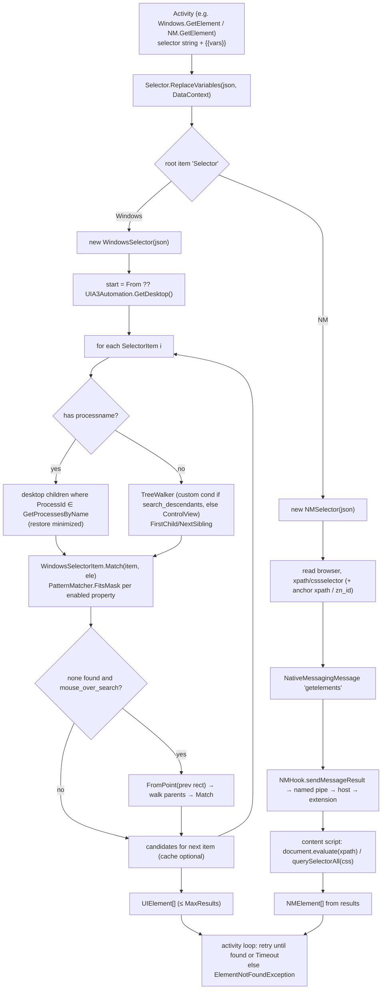

# OpenRPA — Selector System

All paths relative to `reference/openrpa/` (commit `b78115e`).

## 1. Representation

| Class | Project | File | Responsibility |
|---|---|---|---|
| `Selector : SelectorObservableCollection<SelectorItem>` | OpenRPA.Interfaces | `OpenRPA.Interfaces/Selector/Selector.cs` | Ordered list of path steps; `ToString()` = JSON array of enabled items; `Selector(string json)` parses; `virtual GetElements(from, max)`; static `ReplaceVariables(selector, DataContext)` for `{{var}}` |
| `SelectorItem : ObservableObject` | OpenRPA.Interfaces | `.../Selector/SelectorItem.cs` | One step = collection of `SelectorItemProperty`; `Enabled`, `canDisable`; `json` = JObject of enabled properties; `Selector` property (non-null on the root/meta item) |
| `SelectorItemProperty` | OpenRPA.Interfaces | `.../Selector/SelectorItemProperty.cs` | `Name`, `Value` (string), `Enabled` (default: everything except `ControlType`), `canDisable` |
| `treeelement` | OpenRPA.Interfaces | `.../Selector/treeelement.cs` | Lazy tree node for the selector editor's element tree |
| `SelectorWindow`, `SelectorModel` | OpenRPA.Interfaces | `.../Selector/SelectorWindow.xaml.cs`, `SelectorModel.cs` | WPF selector editor (tree + properties + highlight/test) |
| `WindowsSelector : Selector` / `WindowsSelectorItem : SelectorItem` | OpenRPA.Windows | `OpenRPA.Windows/WindowsSelector.cs`, `WindowsSelectorItem.cs` | UIA selector generation and resolution |
| `NMSelector : Selector` / `NMSelectorItem` | OpenRPA.NM | `OpenRPA.NM/NMSelector.cs`, `NMSelectorItem.cs` | Browser selector (xpath/css) |

### Serialization (Observed)

A selector is a JSON **array**; each element is a flat object of string properties. The first item is a
**meta/root item** carrying `"Selector": "<technology>"` and technology-wide options.

Windows example (shape derived from `WindowsSelectorItem` ctor, `WindowsSelectorItem.cs:75-174`):

```json
[
  { "Selector": "Windows", "processname": "notepad", "filename": "C:\\Windows\\notepad.exe",
    "arguments": "", "search_descendants": "False", "mouse_over_search": "False" },
  { "ControlType": "Window", "ClassName": "Notepad", "Name": "Untitled - Notepad" },
  { "ControlType": "Document", "ClassName": "Edit", "AutomationId": "15", "FrameworkId": "Win32" }
]
```

Supported Windows step properties: `ClassName`, `Name`, `ControlType`, `AutomationId`, `FrameworkId`,
`IndexInParent`; root: `processname`, `filename`, `arguments`, `isImmersiveProcess`,
`applicationUserModelId`, `search_descendants`, `mouse_over_search`.
Browser root carries `browser` (`chrome` | `ff` | `edge`); the next item carries `xpath` and/or `cssselector`
(`NMSelector.GetElementsWithuiSelector`, `NMSelector.cs:77-105`).

Values support wildcards via `PatternMatcher.FitsMask(value, mask)` (`OpenRPA.Interfaces/PatternMatcher.cs`).
Variables in selector text use `{{name}}` and are replaced at runtime.

## 2. Generation (Windows)

`new WindowsSelector(AutomationElement element, WindowsSelector anchor, bool doEnum)` (`WindowsSelector.cs:20`):
1. Walk `element.Parent` up to the desktop → `pathToRoot`.
2. If `PluginConfig.remove_fisrt_window`, trim above the **last** `Window` in the path.
3. If `anchor` given: remove the anchor prefix (match by `WindowsSelectorItem.Match`).
4. Optional `traverse_selector_both_ways`: re-walk top-down using `matches(...)` to drop steps that can't be found from the parent.
5. Root item from the base element's process info (`GetProcessInfo()`), `Selector = "Windows"`.
6. If `search_descendants && create_short_selector`: emit only root + base + target (short selector).
7. Otherwise one `WindowsSelectorItem` per path element; computes `IndexInParent` (disabled by default);
   disables `ClassName` with dotted .NET names, special-cases shell/start menu/`SysListView32`.
8. If `doEnum` (`enum_selector_properties`): `EnumNeededProperties` progressively enables
   `ControlType → ClassName → AutomationId → Name → Index` until `parent.FindAllChildren(cond)` returns exactly 1
   (`WindowsSelectorItem.cs:194`) — a **uniqueness minimizer**.

## 3. Resolution (Windows)

`WindowsSelector.GetElementsWithuiSelector(selector, fromElement, maxresults, ext)` (`WindowsSelector.cs:501`):
1. `automation = ext?.automation ?? AutomationUtil.getAutomation()` (new `FlaUI.UIA3.UIA3Automation`).
2. Start at `fromElement` (anchor) or `automation.GetDesktop()`.
3. For each selector item *i* (item 0 = root meta):
   - For `i == 1`, first check whether the current candidates already match (handles anchors pointing at the window).
   - `GetElementsWithuiSelectorItem(i, automation, item, currentCandidates, maxresults, isLast, search_descendants)`:
     - Optional **match cache** keyed by `(root element, ident, condition string)` (`WindowsSelectorItem.GetFromCache/AddToCache`).
     - If the item has `processname`: enumerate top-level children of the desktop filtered by `ProcessId ∈ Process.GetProcessesByName(...)`
       in the current session; **restores minimized windows** (`SetWindowVisualState(Normal)`).
     - Else: `TreeWalker` = `GetCustomTreeWalker(cond)` when `search_descendants`, else `GetControlViewWalker()`;
       iterate `GetFirstChild` / `GetNextSibling`, keep elements where `WindowsSelectorItem.Match(item, ele)`.
       Retries `GetFirstChild` up to 10 times on COM errors.
   - If no match mid-path and `mouse_over_search`: focus the previous candidate, `automation.FromPoint(rect.X+5, rect.Y+5)`,
     walk parents to find a match (fallback strategy).
4. Truncate to `maxresults`, wrap each as `UIElement`.

`WindowsSelectorItem.Match(SelectorItem, AutomationElement)` (`WindowsSelectorItem.cs:527`): for each enabled property,
read the UIA property and compare with `PatternMatcher.FitsMask`; `IndexInParent` compares with `Parent.FindAllChildren()[i]`.

The **retry/timeout loop** lives in the activity, not the resolver: `Windows.GetElement.StartLoop` repeats until
`elements.Length > 0 || sw.Elapsed >= Timeout`, clearing the cache after 3 failures, optionally resolving on a
separate STA thread (`PluginConfig.get_elements_in_different_thread`), then throws `ElementNotFoundException`
if fewer than `MinResults`.

## 4. Resolution (Browser)

`NMSelector.GetElementsWithuiSelector(selector, fromElement, maxresults)` (`NMSelector.cs:77`):
reads `browser` from item 0 and `xpath`/`cssselector` from item 1; if an anchor `NMElement` is given, prefixes its
xpath (or uses `//*[@zn_id="..."]` when `use_zn`); sends one `NativeMessagingMessage("getelements")` through
`NMHook.sendMessageResult(msg, PluginConfig.protocol_timeout)`; the **page script** evaluates it
(`document.evaluate(xpath, ...)` in `openrpautil.getelements`, `OpenRPA.NativeMessagingHost/openrpautil.js:285`)
and returns matches; each result with `xPath == "true" || cssPath == "true"` becomes an `NMElement`.

### Diagram 6 — Selector resolution



## 5. Multiple strategies / Browser vs Windows

Observed strategies:
- Windows: hierarchical property path (UIA), optional descendant search, optional mouse-over fallback,
  index-in-parent, process scoping, wildcard values, anchor (`From`) scoping.
- Browser: XPath and CSS path computed in-page; optional unique attribute ids (`PluginConfig.unique_xpath_ids`,
  default list in `openrpautil.js:2`: `ng-model`, `ng-reflect-name`), `zn_id` anchor handles.
- Each technology owns its selector subclass; there is no cross-technology selector abstraction beyond
  "JSON array of string property bags with a `Selector` discriminator".

## MyRPA implication

- **Retain**: selector = serializable, human-editable, technology-discriminated document; path of property
  bags with per-property enable/disable; wildcards; `{{variable}}` substitution; anchors; uniqueness
  minimization during generation; "resolve returns N candidates, activity enforces Min/Max + timeout".
- **Redesign**: typed selector schema (versioned) instead of all-strings; the retry/timeout policy should be
  a shared resolver service, not duplicated inside each activity; browser selectors should use Playwright
  locators (role/text/test-id/css/xpath) as first-class strategies (PRD 6.1) with a fallback chain.
- **Avoid**: side effects inside resolution (restoring minimized windows, moving focus for mouse-over search)
  unless explicitly requested by the activity.
