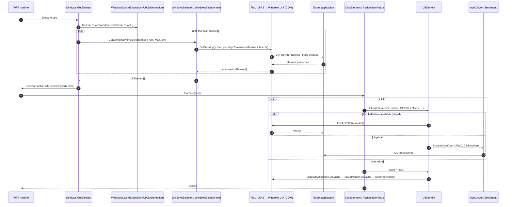

# OpenRPA — Windows (Desktop) Automation, Automation Elements, and Office

All paths relative to `reference/openrpa/` (commit `b78115e`).

## 1. Automation element abstraction

**Interface** `IElement` (`OpenRPA.Interfaces/IElement.cs`):

```csharp
object RawElement { get; set; }                 // provider-native handle (FlaUI AutomationElement, NM message, ...)
System.Drawing.Rectangle Rectangle { get; set; } // screen rect
string Value { get; set; }                       // read/write value
string Name { get; set; }
void Focus();
void Refresh();
void Click(bool VirtualClick, MouseButton Button, int OffsetX, int OffsetY, bool DoubleClick, bool AnimateMouse);
Task Highlight(bool Blocking, Color Color, TimeSpan Duration);
string ImageString();                            // base64 screenshot of the element
IElement[] Items { get; }                        // children / list items
```

Implementations (Observed): `UIElement` (Windows/UIA, **in OpenRPA.Interfaces**), `NMElement` (browser),
plus technology-specific ones in IE/Java/SAP/Image plugins (not read in depth).

Analysis: `IElement` is the provider boundary that makes generic activities (`ClickElement`,
`TypeText`, `HighlightElement`, `Assign item.Value`) work across technologies. It mixes *query*
(Value/Name/Items), *action* (Click/Focus), and *UI* (Highlight/ImageString) concerns, and has no
async, cancellation, wait, or capability discovery.

## 2. `UIElement` — Windows element

| | |
|---|---|
| Project | OpenRPA.Interfaces (not OpenRPA.Windows) |
| Class | `OpenRPA.UIElement : IElement` |
| File | `OpenRPA.Interfaces/UIElement.cs:25` |
| Wraps | `FlaUI.Core.AutomationElements.AutomationElement` (UIA3) **or** `System.Windows.Automation.AutomationElement` (managed UIA) |
| Responsibility | Properties (`ProcessId`, `Name`, `ClassName`, `FrameworkId`, `ControlType`, `SupportInput`, `SupportSelect`, `ProcessName`, `Parent`), actions (`Click`, `Focus`, `TypeText`, `Enter`, `SelectItem`, `SetPosition`, window move/resize/close), reading (`Value` via Value/Text/LegacyIAccessible patterns; refuses password fields), `AsDataTable()`, `Highlight`, `ImageString` |

`UIElement.Click` (`UIElement.cs:307`):
- `VirtualClick && Button == Left` → `InvokePattern.Invoke()` (FlaUI or managed UIA); falls back to physical if unsupported.
- Physical → `Input.InputDriver.Instance.MouseMove(Rectangle.X + OffsetX, Rectangle.Y + OffsetY)` (or `AnimateMouseMove`)
  → `InputDriver.Click(Button)` (twice for double-click).

`UIElement.Value` getter uses `Patterns.Value` then `Patterns.Text`, throwing `MethodNotSupportedException` for password fields.
The setter tries `LegacyIAccessible.SetValue`, then `ValuePattern.SetValue`, then falls back to `Enter(value)` (keyboard input).

## 3. Windows provider components

| Component | Class | File | Responsibility |
|---|---|---|---|
| Plugin | `OpenRPA.Windows.Plugin : IRecordPlugin` ("Windows", Priority 10) | `OpenRPA.Windows/Plugin.cs:19` | Recorder, `GetElementsWithSelector`, `LaunchBySelector` (starts process from root `filename/arguments` or AUMID), `CloseBySelector`, `GetRootElements` (element tree for selector editor) |
| Settings | `PluginConfig` | `OpenRPA.Windows/PluginConfig.cs` | `enable_cache`, `cache_timeout`, `search_timeout`, `search_descendants`, `create_short_selector`, `traverse_selector_both_ways`, `allow_multiple_hits_mid_selector`, `try_mouse_over_search`, `get_elements_in_different_thread`, `enum_selector_properties`, `remove_fisrt_window`, ... |
| Selector | `WindowsSelector`, `WindowsSelectorItem` | `OpenRPA.Windows/WindowsSelector*.cs` | See [openrpa-selectors.md](openrpa-selectors.md) |
| Tree node | `WindowsTreeElement : treeelement` | `OpenRPA.Windows/WindowsTreeElement.cs` | Selector editor tree |
| Per-run extension | `WindowsCacheExtension : ICustomWorkflowExtension, IDisposable` | `OpenRPA.Windows/WindowsCacheExtension.cs` | Holds one `UIA3Automation` per workflow instance; disposed with it |
| Activities | `GetElement`, `GetWindows`, `CloseWindow` | `OpenRPA.Windows/Activities/` | Find/iterate elements & windows |
| Detectors | `WindowsClickDetectorPlugin` (InputDriver `OnMouseUp` + selector match), `WindowsElementDetectorPlugin` (`desktop.RegisterStructureChangedEvent(TreeScope.Descendants, ...)`) | `OpenRPA.Windows/*.cs` | Event triggers |
| UIA factory | `AutomationUtil.getAutomation()` → `new FlaUI.UIA3.UIA3Automation()` (new instance per call) | `OpenRPA.Interfaces/AutomationUtil.cs:13` | |
| Hit test | `AutomationHelper.GetFromPoint(x, y)` | `OpenRPA.Interfaces/AutomationHelper.cs:64` | `automation.FromPoint` |
| Input | `InputDriver` (LL hooks; `MouseMove`, `AnimateMouseMove`, `Click`), `FlaUI.Core.Input.Keyboard` (in `TypeText`, `ClickElement` modifiers) | `OpenRPA.Interfaces/Input/*` | Physical input simulation |
| Generic actions | `ClickElement`, `TypeText`, `FocusElement`, `HighlightElement`, `MoveElement`, `OpenApplication`, `CloseApplication` | `OpenRPA/Activities/` | Provider-agnostic via `IElement` / selectors |

Threading: UIA/COM calls are made on the WF4 worker thread, or on a dedicated STA thread via
`AutomationHelper.RunSTAThread` when `get_elements_in_different_thread` (then re-resolved on the calling
thread "because we need the COM objects to be loaded in the UI thread", `GetElement.cs`).

### Diagram 8 — Windows automation



## 4. Events

- Element/structure events: `WindowsElementDetectorPlugin` subscribes to UIA `StructureChanged` on the desktop and
  fires `OnDetector` when a configured selector matches (`WindowsElementDetectorPlugin.cs:67-144`).
- Click events: `WindowsClickDetectorPlugin` listens to `InputDriver.OnMouseUp` (`WindowsClickDetectorPlugin.cs:65-126`).
- Keyboard: `KeyboardDetectorPlugin` (`OpenRPA.Interfaces/KeyboardDetectorPlugin.cs`).
- Global cancel key: `InputDriver.initCancelKey(Config.local.cancelkey)` at startup.

## 5. Office automation (isolation)

| | |
|---|---|
| Project | `OpenRPA.Office` (net462), references only `OpenRPA.Interfaces` + Office PIA DLLs from `lib/` (`Microsoft.Office.Interop.Excel/Outlook/PowerPoint/Word`, `office`) |
| Plugin | `OpenRPA.Office.Plugin : IRecordPlugin` ("Office") — selector/recorder methods return empty; exists for plugin recognition and settings |
| COM access | `officewrap` static (`OpenRPA.Office/Activities/ExcelActivity.cs:11`): `Marshal.GetActiveObject("Excel.Application")` or new `Application`; shared static instance |
| Activity bases | `ExcelActivity : CodeActivity` (`ExcelActivity.cs:82`) and `ExcelActivityOf<TResult> : NativeActivity<TResult>` (line 244) open/attach workbook by filename, handle `Visible`, `SaveChanges`, `DisplayAlerts`, `Quit` |
| Activities | Excel, Word, Outlook, PowerPoint activities (see activities doc) |

Observed: Office isolation is only at the **assembly** level (separate plugin project). Execution is
in-process COM automation of the user's installed Office, through a process-wide static application object.
There is no provider interface (`IOfficeProvider`-like) — activities call Interop directly.

## MyRPA implication

- **Retain**: `IElement`-style common element contract; virtual (pattern-based) vs physical input choice per action;
  per-run automation context disposed with the run (`WindowsCacheExtension`); UIA `StructureChanged`-based triggers.
- **Redesign**: move `UIElement` and FlaUI out of the contracts assembly into the Windows provider; make element
  operations async + cancellable; separate element *query* from *action* and from *UI* (highlight/screenshot);
  explicit STA/COM threading policy inside the provider; single long-lived UIA automation per provider session.
- **Office**: keep behind a provider interface; prefer file-based libraries (OpenXML/ClosedXML) for data tasks and use
  COM Interop only when the live application is required; never share a process-wide static COM object across runs.
- **Note for .NET 10**: FlaUI supports modern .NET (net6+ targets exist upstream — to be confirmed at Phase 7 package
  selection); Windows UIA requires `net10.0-windows` TFM for the Windows provider only (Core stays platform-neutral).
